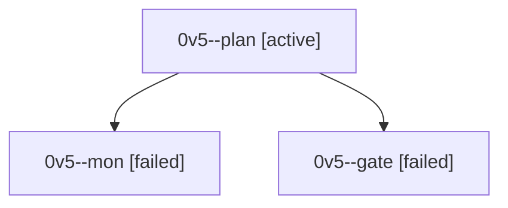

# Session: 0v5

[Agent Hoods](../README.md) / [bbugyi200](../users/bbugyi200/README.md) / [athena](../users/bbugyi200/machines/athena/README.md) / [0v5](../users/bbugyi200/machines/athena/hoods/0v5/README.md) / 0v5

Owner: `bbugyi200.athena` · Hood: `0v5` · Members: 3

## Lineage

The diagram is an optional enhancement; the ordered table below contains the same lineage in accessible text.

| Role | Agent | State | Model / provider | Timing | Commits | Prompt | Chat |
|---|---|---|---|---|---:|---|---|
| plan | 0v5--plan | active | opus / claude | 2026-10-01T21:31:42.978488+00:00 | 0 | [Prompt](../agents/bbugyi200.athena.0v5--plan/prompt.md) | [Chat](../agents/bbugyi200.athena.0v5--plan/chat.md) |
| mon | 0v5--mon | failed | opus / claude | 2026-10-01T21:55:42.976458+00:00 → 2026-10-01T21:57:58.841346+00:00 | 0 | — | [Chat](../agents/bbugyi200.athena.0v5--mon/chat.md) |
| gate | 0v5--gate | failed | opus / claude | 2026-10-01T21:55:19.818036+00:00 → 2026-10-01T21:55:43.677137+00:00 | 0 | — | [Chat](../agents/bbugyi200.athena.0v5--gate/chat.md) |
