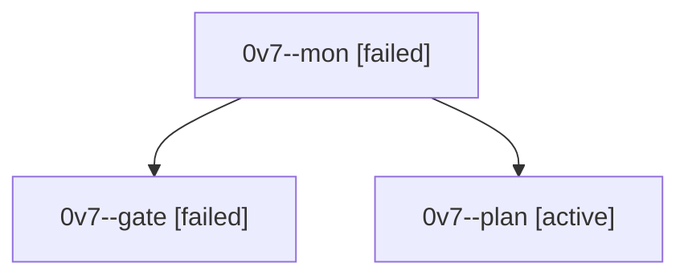

# Session: 0v7

[Agent Hoods](../README.md) / [bbugyi200](../users/bbugyi200/README.md) / [athena](../users/bbugyi200/machines/athena/README.md) / [0v7](../users/bbugyi200/machines/athena/hoods/0v7/README.md) / 0v7

Owner: `bbugyi200.athena` · Hood: `0v7` · Members: 3

## Lineage

The diagram is an optional enhancement; the ordered table below contains the same lineage in accessible text.

| Role | Agent | State | Model / provider | Timing | Commits | Prompt | Chat |
|---|---|---|---|---|---:|---|---|
| mon | 0v7--mon | failed | opus / claude | 2026-10-01T22:28:52.921949+00:00 → 2026-10-01T22:30:58.517994+00:00 | 0 | — | [Chat](../agents/bbugyi200.athena.0v7--mon/chat.md) |
| gate | 0v7--gate | failed | opus / claude | 2026-10-01T22:28:22.480957+00:00 → 2026-10-01T22:28:53.711324+00:00 | 0 | — | [Chat](../agents/bbugyi200.athena.0v7--gate/chat.md) |
| plan | 0v7--plan | active | opus / claude | 2026-10-01T22:14:55.561728+00:00 | 0 | [Prompt](../agents/bbugyi200.athena.0v7--plan/prompt.md) | [Chat](../agents/bbugyi200.athena.0v7--plan/chat.md) |
