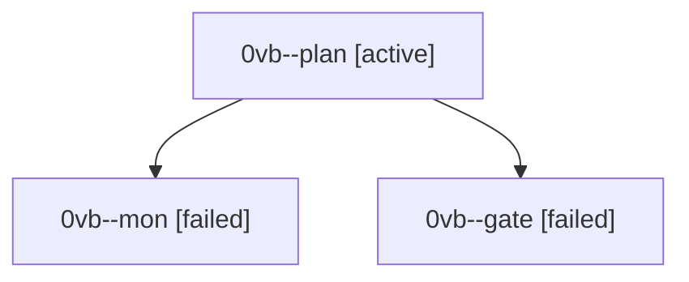

# Session: 0vb

[Agent Hoods](../README.md) / [bbugyi200](../users/bbugyi200/README.md) / [athena](../users/bbugyi200/machines/athena/README.md) / [0vb](../users/bbugyi200/machines/athena/hoods/0vb/README.md) / 0vb

Owner: `bbugyi200.athena` · Hood: `0vb` · Members: 3

## Lineage

The diagram is an optional enhancement; the ordered table below contains the same lineage in accessible text.

| Role | Agent | State | Model / provider | Timing | Commits | Prompt | Chat |
|---|---|---|---|---|---:|---|---|
| plan | 0vb--plan | active | opus / claude | 2026-10-02T13:37:17.580418+00:00 | 0 | [Prompt](../agents/bbugyi200.athena.0vb--plan/prompt.md) | [Chat](../agents/bbugyi200.athena.0vb--plan/chat.md) |
| mon | 0vb--mon | failed | opus / claude | 2026-10-02T13:49:27.345238+00:00 → 2026-10-02T13:53:11.639746+00:00 | 0 | — | [Chat](../agents/bbugyi200.athena.0vb--mon/chat.md) |
| gate | 0vb--gate | failed | opus / claude | 2026-10-02T13:48:59.245957+00:00 → 2026-10-02T13:49:28.594896+00:00 | 0 | — | [Chat](../agents/bbugyi200.athena.0vb--gate/chat.md) |
