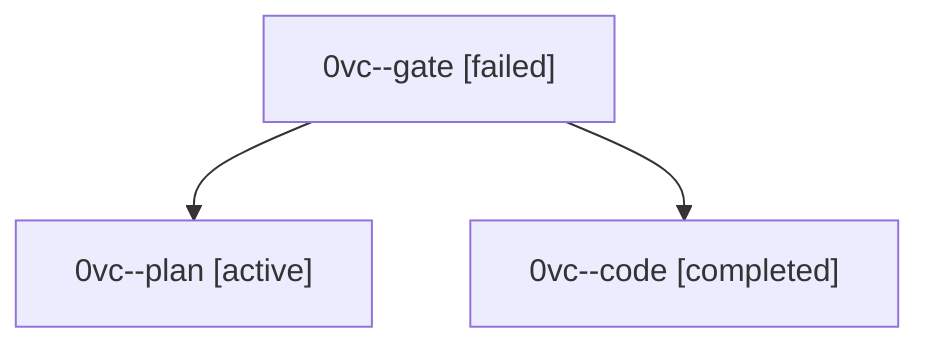

# Session: 0vc

[Agent Hoods](../README.md) / [bbugyi200](../users/bbugyi200/README.md) / [athena](../users/bbugyi200/machines/athena/README.md) / [0vc](../users/bbugyi200/machines/athena/hoods/0vc/README.md) / 0vc

Owner: `bbugyi200.athena` · Hood: `0vc` · Members: 3

## Lineage

The diagram is an optional enhancement; the ordered table below contains the same lineage in accessible text.

| Role | Agent | State | Model / provider | Timing | Commits | Prompt | Chat |
|---|---|---|---|---|---:|---|---|
| gate | 0vc--gate | failed | opus / claude | 2026-10-02T14:05:09.682579+00:00 → 2026-10-02T14:05:34.506741+00:00 | 0 | — | [Chat](../agents/bbugyi200.athena.0vc--gate/chat.md) |
| plan | 0vc--plan | active | opus / claude | 2026-10-02T13:46:15.641573+00:00 | 0 | [Prompt](../agents/bbugyi200.athena.0vc--plan/prompt.md) | [Chat](../agents/bbugyi200.athena.0vc--plan/chat.md) |
| code | 0vc--code | completed | muse-spark-1.3-contributor / muse | 2026-10-02T14:05:48.563007+00:00 → 2026-10-02T15:08:44.962590+00:00 | [1](../agents/bbugyi200.athena.0vc--code/README.md#commits) | — | [Chat](../agents/bbugyi200.athena.0vc--code/chat.md) |

## Commits

| Role | Repo | Commit | Subject | Committed |
|---|---|---|---|---|
| code | bob-cli | [`74f47d4`](https://github.com/bobs-org/bob-cli/commit/74f47d46ee3db9b3318abeedc965dee65d9d7227) | feat(capture): land the inline single-entry close on the =x line | 2026-10-02 11:07:14 EDT |
