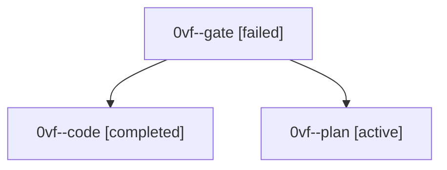

# Session: 0vf

[Agent Hoods](../README.md) / [bbugyi200](../users/bbugyi200/README.md) / [athena](../users/bbugyi200/machines/athena/README.md) / [0vf](../users/bbugyi200/machines/athena/hoods/0vf/README.md) / 0vf

Owner: `bbugyi200.athena` · Hood: `0vf` · Members: 3

## Lineage

The diagram is an optional enhancement; the ordered table below contains the same lineage in accessible text.

| Role | Agent | State | Model / provider | Timing | Commits | Prompt | Chat |
|---|---|---|---|---|---:|---|---|
| gate | 0vf--gate | failed | gpt-6-astra / codex | 2026-10-02T17:00:52.282631+00:00 → 2026-10-02T17:01:26.577517+00:00 | 0 | — | [Chat](../agents/bbugyi200.athena.0vf--gate/chat.md) |
| code | 0vf--code | completed | muse-spark-1.3-contributor / muse | 2026-10-02T17:01:46.227265+00:00 → 2026-10-02T17:37:11.352077+00:00 | [1](../agents/bbugyi200.athena.0vf--code/README.md#commits) | — | [Chat](../agents/bbugyi200.athena.0vf--code/chat.md) |
| plan | 0vf--plan | active | gpt-6-astra / codex | 2026-10-02T16:52:00.232215+00:00 | 0 | [Prompt](../agents/bbugyi200.athena.0vf--plan/prompt.md) | [Chat](../agents/bbugyi200.athena.0vf--plan/chat.md) |

## Commits

| Role | Repo | Commit | Subject | Committed |
|---|---|---|---|---|
| code | bob-cli | [`f589d07`](https://github.com/bobs-org/bob-cli/commit/f589d0783cb1d63a2194d5a8e6b8da7e8282d512) | feat(capture): add =\* and =! close shorthands defaulting to task 1 | 2026-10-02 13:35:16 EDT |
