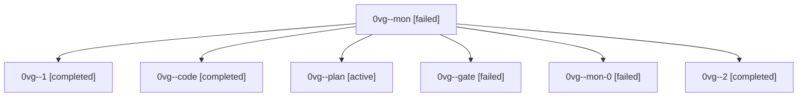

# Session: 0vg

[Agent Hoods](../README.md) / [bbugyi200](../users/bbugyi200/README.md) / [athena](../users/bbugyi200/machines/athena/README.md) / [0vg](../users/bbugyi200/machines/athena/hoods/0vg/README.md) / 0vg

Owner: `bbugyi200.athena` · Hood: `0vg` · Members: 7

## Lineage

The diagram is an optional enhancement; the ordered table below contains the same lineage in accessible text.

| Role | Agent | State | Model / provider | Timing | Commits | Prompt | Chat |
|---|---|---|---|---|---:|---|---|
| mon | 0vg--mon | failed | muse-spark-1.3-contributor / muse | 2026-10-02T17:36:33.248729+00:00 → 2026-10-02T17:39:03.715519+00:00 | 0 | — | [Chat](../agents/bbugyi200.athena.0vg--mon/chat.md) |
| 1 | 0vg--1 | completed | muse-spark-1.3-contributor / muse | 2026-10-02T17:39:18.315716+00:00 → 2026-10-02T17:43:13.293114+00:00 | 0 | [Prompt](../agents/bbugyi200.athena.0vg--1/prompt.md) | [Chat](../agents/bbugyi200.athena.0vg--1/chat.md) |
| code | 0vg--code | completed | muse-spark-1.3-contributor / muse | 2026-10-02T17:06:46.365682+00:00 → 2026-10-02T17:37:10.993838+00:00 | 0 | — | [Chat](../agents/bbugyi200.athena.0vg--code/chat.md) |
| plan | 0vg--plan | active | gpt-6-astra / codex | 2026-10-02T16:59:09.138840+00:00 | 0 | [Prompt](../agents/bbugyi200.athena.0vg--plan/prompt.md) | [Chat](../agents/bbugyi200.athena.0vg--plan/chat.md) |
| gate | 0vg--gate | failed | gpt-6-astra / codex | 2026-10-02T17:06:11.510660+00:00 → 2026-10-02T17:06:32.671888+00:00 | 0 | — | [Chat](../agents/bbugyi200.athena.0vg--gate/chat.md) |
| mon-0 | 0vg--mon-0 | failed | muse-spark-1.3-contributor / muse | 2026-10-02T17:42:44.546195+00:00 → 2026-10-02T17:44:26.707467+00:00 | 0 | — | [Chat](../agents/bbugyi200.athena.0vg--mon-0/chat.md) |
| 2 | 0vg--2 | completed | muse-spark-1.3-contributor / muse | 2026-10-02T17:44:40.456950+00:00 → 2026-10-02T17:51:12.117442+00:00 | 0 | [Prompt](../agents/bbugyi200.athena.0vg--2/prompt.md) | [Chat](../agents/bbugyi200.athena.0vg--2/chat.md) |
