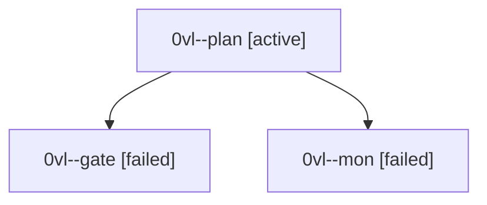

# Session: 0vl

[Agent Hoods](../README.md) / [bbugyi200](../users/bbugyi200/README.md) / [athena](../users/bbugyi200/machines/athena/README.md) / [0vl](../users/bbugyi200/machines/athena/hoods/0vl/README.md) / 0vl

Owner: `bbugyi200.athena` · Hood: `0vl` · Members: 3

## Lineage

The diagram is an optional enhancement; the ordered table below contains the same lineage in accessible text.

| Role | Agent | State | Model / provider | Timing | Commits | Prompt | Chat |
|---|---|---|---|---|---:|---|---|
| plan | 0vl--plan | active | opus / claude | 2026-10-02T20:23:40.001575+00:00 | 0 | [Prompt](../agents/bbugyi200.athena.0vl--plan/prompt.md) | [Chat](../agents/bbugyi200.athena.0vl--plan/chat.md) |
| gate | 0vl--gate | failed | opus / claude | 2026-10-02T20:52:33.867225+00:00 → 2026-10-02T20:54:29.489175+00:00 | 0 | — | [Chat](../agents/bbugyi200.athena.0vl--gate/chat.md) |
| mon | 0vl--mon | failed | opus / claude | 2026-10-02T20:54:28.194424+00:00 → 2026-10-02T21:02:38.664147+00:00 | 0 | — | [Chat](../agents/bbugyi200.athena.0vl--mon/chat.md) |
