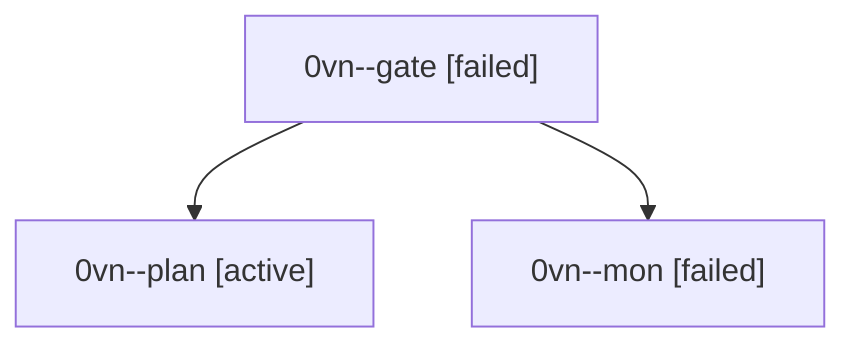

# Session: 0vn

[Agent Hoods](../README.md) / [bbugyi200](../users/bbugyi200/README.md) / [athena](../users/bbugyi200/machines/athena/README.md) / [0vn](../users/bbugyi200/machines/athena/hoods/0vn/README.md) / 0vn

Owner: `bbugyi200.athena` · Hood: `0vn` · Members: 3

## Lineage

The diagram is an optional enhancement; the ordered table below contains the same lineage in accessible text.

| Role | Agent | State | Model / provider | Timing | Commits | Prompt | Chat |
|---|---|---|---|---|---:|---|---|
| gate | 0vn--gate | failed | gpt-6-astra / codex | 2026-10-03T09:16:26.397502+00:00 → 2026-10-03T09:16:46.915717+00:00 | 0 | — | [Chat](../agents/bbugyi200.athena.0vn--gate/chat.md) |
| plan | 0vn--plan | active | gpt-6-astra / codex | 2026-10-03T09:08:28.784187+00:00 | 0 | [Prompt](../agents/bbugyi200.athena.0vn--plan/prompt.md) | [Chat](../agents/bbugyi200.athena.0vn--plan/chat.md) |
| mon | 0vn--mon | failed | gpt-6-astra / codex | 2026-10-03T09:16:46.273590+00:00 → 2026-10-03T09:19:00.857293+00:00 | 0 | — | [Chat](../agents/bbugyi200.athena.0vn--mon/chat.md) |
