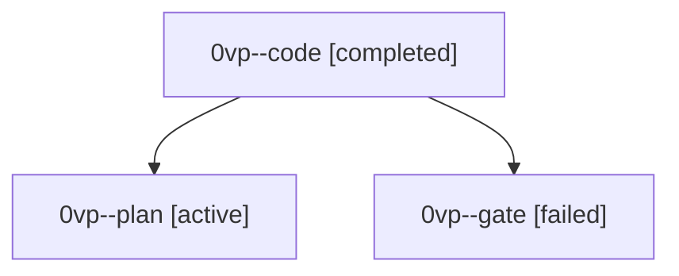

# Session: 0vp

[Agent Hoods](../README.md) / [bbugyi200](../users/bbugyi200/README.md) / [athena](../users/bbugyi200/machines/athena/README.md) / [0vp](../users/bbugyi200/machines/athena/hoods/0vp/README.md) / 0vp

Owner: `bbugyi200.athena` · Hood: `0vp` · Members: 3

## Lineage

The diagram is an optional enhancement; the ordered table below contains the same lineage in accessible text.

| Role | Agent | State | Model / provider | Timing | Commits | Prompt | Chat |
|---|---|---|---|---|---:|---|---|
| code | 0vp--code | completed | muse-spark-1.3-contributor / muse | 2026-10-03T18:28:02.310872+00:00 → 2026-10-03T19:00:18.315500+00:00 | [1](../agents/bbugyi200.athena.0vp--code/README.md#commits) | — | [Chat](../agents/bbugyi200.athena.0vp--code/chat.md) |
| plan | 0vp--plan | active | opus / claude | 2026-10-03T18:12:57.511234+00:00 | 0 | [Prompt](../agents/bbugyi200.athena.0vp--plan/prompt.md) | [Chat](../agents/bbugyi200.athena.0vp--plan/chat.md) |
| gate | 0vp--gate | failed | opus / claude | 2026-10-03T18:26:09.871101+00:00 → 2026-10-03T18:27:44.055873+00:00 | 0 | — | [Chat](../agents/bbugyi200.athena.0vp--gate/chat.md) |

## Commits

| Role | Repo | Commit | Subject | Committed |
|---|---|---|---|---|
| code | bob-cli | [`54712fe`](https://github.com/bobs-org/bob-cli/commit/54712fea416c468ca167ebf941e4558e1e5a9a0e) | feat(freshness): gate ^prj review on #hide and walk ^ref in REFERENCES | 2026-10-03 14:55:06 EDT |
