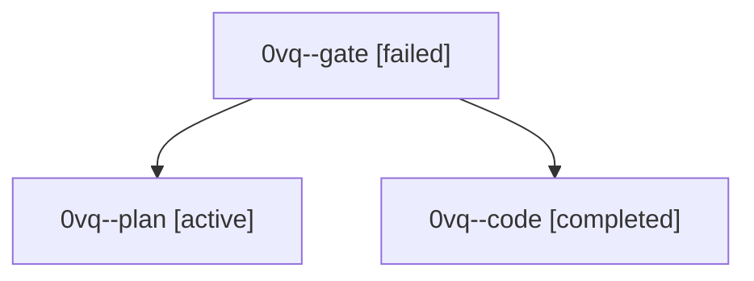

# Session: 0vq

[Agent Hoods](../README.md) / [bbugyi200](../users/bbugyi200/README.md) / [athena](../users/bbugyi200/machines/athena/README.md) / [0vq](../users/bbugyi200/machines/athena/hoods/0vq/README.md) / 0vq

Owner: `bbugyi200.athena` · Hood: `0vq` · Members: 3

## Lineage

The diagram is an optional enhancement; the ordered table below contains the same lineage in accessible text.

| Role | Agent | State | Model / provider | Timing | Commits | Prompt | Chat |
|---|---|---|---|---|---:|---|---|
| gate | 0vq--gate | failed | gpt-6-astra / codex | 2026-10-03T18:39:18.639761+00:00 → 2026-10-03T18:40:27.174303+00:00 | 0 | — | [Chat](../agents/bbugyi200.athena.0vq--gate/chat.md) |
| plan | 0vq--plan | active | gpt-6-astra / codex | 2026-10-03T18:27:01.951076+00:00 | 0 | [Prompt](../agents/bbugyi200.athena.0vq--plan/prompt.md) | [Chat](../agents/bbugyi200.athena.0vq--plan/chat.md) |
| code | 0vq--code | completed | muse-spark-1.3-contributor / muse | 2026-10-03T18:40:34.813475+00:00 → 2026-10-03T18:54:36.563547+00:00 | [1](../agents/bbugyi200.athena.0vq--code/README.md#commits) | — | [Chat](../agents/bbugyi200.athena.0vq--code/chat.md) |

## Commits

| Role | Repo | Commit | Subject | Committed |
|---|---|---|---|---|
| code | bob-cli | [`1c2c488`](https://github.com/bobs-org/bob-cli/commit/1c2c488fd35e4e72af16270bd9cb897204bb4372) | docs(dashboard): describe grouped Work/Review/Browse navigation and child pages | 2026-10-03 14:53:05 EDT |
