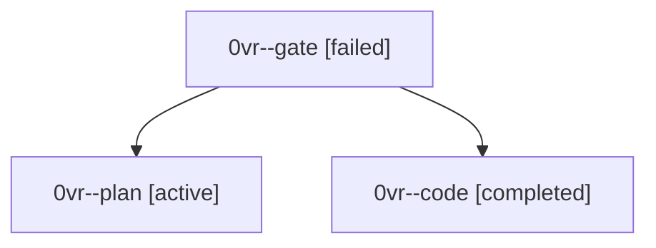

# Session: 0vr

[Agent Hoods](../README.md) / [bbugyi200](../users/bbugyi200/README.md) / [athena](../users/bbugyi200/machines/athena/README.md) / [0vr](../users/bbugyi200/machines/athena/hoods/0vr/README.md) / 0vr

Owner: `bbugyi200.athena` · Hood: `0vr` · Members: 3

## Lineage

The diagram is an optional enhancement; the ordered table below contains the same lineage in accessible text.

| Role | Agent | State | Model / provider | Timing | Commits | Prompt | Chat |
|---|---|---|---|---|---:|---|---|
| gate | 0vr--gate | failed | gpt-6.1-sol / codex | 2026-10-03T18:44:44.417709+00:00 → 2026-10-03T18:45:51.404018+00:00 | 0 | — | [Chat](../agents/bbugyi200.athena.0vr--gate/chat.md) |
| plan | 0vr--plan | active | gpt-6.1-sol / codex | 2026-10-03T18:39:47.221817+00:00 | 0 | [Prompt](../agents/bbugyi200.athena.0vr--plan/prompt.md) | [Chat](../agents/bbugyi200.athena.0vr--plan/chat.md) |
| code | 0vr--code | completed | muse-spark-1.3-contributor / muse | 2026-10-03T18:46:09.325573+00:00 → 2026-10-03T18:57:00.370109+00:00 | [1](../agents/bbugyi200.athena.0vr--code/README.md#commits) | — | [Chat](../agents/bbugyi200.athena.0vr--code/chat.md) |

## Commits

| Role | Repo | Commit | Subject | Committed |
|---|---|---|---|---|
| code | bob-cli | [`f3e64a6`](https://github.com/bobs-org/bob-cli/commit/f3e64a68391aa7f61020b780b179571cafa16f1f) | feat(highlights): stamp created frontmatter on new reference notes | 2026-10-03 14:56:24 EDT |
