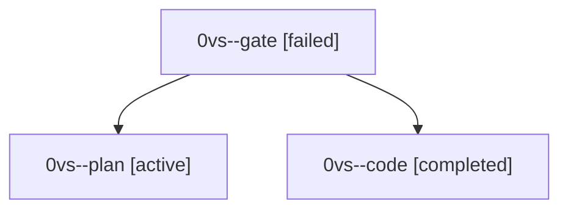

# Session: 0vs

[Agent Hoods](../README.md) / [bbugyi200](../users/bbugyi200/README.md) / [athena](../users/bbugyi200/machines/athena/README.md) / [0vs](../users/bbugyi200/machines/athena/hoods/0vs/README.md) / 0vs

Owner: `bbugyi200.athena` · Hood: `0vs` · Members: 3

## Lineage

The diagram is an optional enhancement; the ordered table below contains the same lineage in accessible text.

| Role | Agent | State | Model / provider | Timing | Commits | Prompt | Chat |
|---|---|---|---|---|---:|---|---|
| gate | 0vs--gate | failed | gpt-6-astra / codex | 2026-10-03T18:49:33.812595+00:00 → 2026-10-03T18:50:34.407454+00:00 | 0 | — | [Chat](../agents/bbugyi200.athena.0vs--gate/chat.md) |
| plan | 0vs--plan | active | gpt-6-astra / codex | 2026-10-03T18:44:25.669723+00:00 | 0 | [Prompt](../agents/bbugyi200.athena.0vs--plan/prompt.md) | [Chat](../agents/bbugyi200.athena.0vs--plan/chat.md) |
| code | 0vs--code | completed | muse-spark-1.3-contributor / muse | 2026-10-03T18:50:40.730953+00:00 → 2026-10-03T18:53:59.646105+00:00 | [1](../agents/bbugyi200.athena.0vs--code/README.md#commits) | — | [Chat](../agents/bbugyi200.athena.0vs--code/chat.md) |

## Commits

| Role | Repo | Commit | Subject | Committed |
|---|---|---|---|---|
| code | bob-cli | [`5a37873`](https://github.com/bobs-org/bob-cli/commit/5a3787320e16c37bef6ca6701c38b7f1274b1bba) | docs(memory): add project and reference note/task glossary terms | 2026-10-03 14:53:12 EDT |
