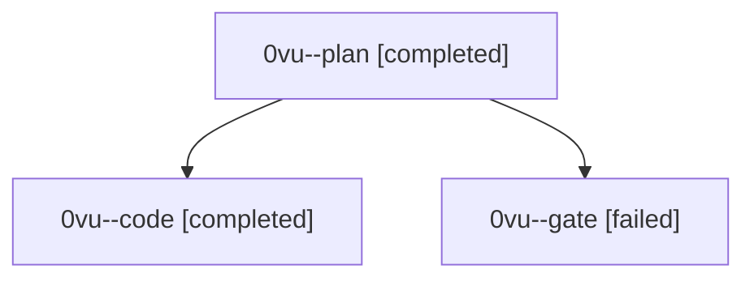

# Session: 0vu

[Agent Hoods](../README.md) / [bbugyi200](../users/bbugyi200/README.md) / [athena](../users/bbugyi200/machines/athena/README.md) / [0vu](../users/bbugyi200/machines/athena/hoods/0vu/README.md) / 0vu

Owner: `bbugyi200.athena` · Hood: `0vu` · Members: 3

## Lineage

The diagram is an optional enhancement; the ordered table below contains the same lineage in accessible text.

| Role | Agent | State | Model / provider | Timing | Commits | Prompt | Chat |
|---|---|---|---|---|---:|---|---|
| plan | 0vu--plan | completed | gpt-6.1-sol / codex | 2026-10-03T18:53:36.789392+00:00 → 2026-10-03T19:59:48.442402+00:00 | 0 | [Prompt](../agents/bbugyi200.athena.0vu--plan/prompt.md) | [Chat](../agents/bbugyi200.athena.0vu--plan/chat.md) |
| code | 0vu--code | completed | grok-4.6 / grok | 2026-10-03T19:08:00.404775+00:00 → 2026-10-03T19:59:48.442402+00:00 | [1](../agents/bbugyi200.athena.0vu--code/README.md#commits) | — | [Chat](../agents/bbugyi200.athena.0vu--code/chat.md) |
| gate | 0vu--gate | failed | gpt-6.1-sol / codex | 2026-10-03T19:06:31.770843+00:00 → 2026-10-03T19:07:45.743937+00:00 | 0 | — | [Chat](../agents/bbugyi200.athena.0vu--gate/chat.md) |

## Commits

| Role | Repo | Commit | Subject | Committed |
|---|---|---|---|---|
| code | bob-cli | [`2ab5961`](https://github.com/bobs-org/bob-cli/commit/2ab5961f1f3a95b077edcf69d13c14d6e0541709) | fix(dataview): share container values and cap FLATTEN expansion | 2026-10-03 15:58:37 EDT |
