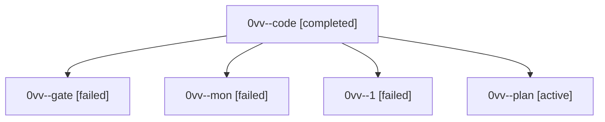

# Session: 0vv

[Agent Hoods](../README.md) / [bbugyi200](../users/bbugyi200/README.md) / [athena](../users/bbugyi200/machines/athena/README.md) / [0vv](../users/bbugyi200/machines/athena/hoods/0vv/README.md) / 0vv

Owner: `bbugyi200.athena` · Hood: `0vv` · Members: 5

## Lineage

The diagram is an optional enhancement; the ordered table below contains the same lineage in accessible text.

| Role | Agent | State | Model / provider | Timing | Commits | Prompt | Chat |
|---|---|---|---|---|---:|---|---|
| code | 0vv--code | completed | grok-4.6 / grok | 2026-10-03T19:19:45.660004+00:00 → 2026-10-03T21:25:06.010759+00:00 | 0 | — | [Chat](../agents/bbugyi200.athena.0vv--code/chat.md) |
| gate | 0vv--gate | failed | gpt-6.1-sol / codex | 2026-10-03T19:18:38.716023+00:00 → 2026-10-03T19:19:29.780576+00:00 | 0 | — | [Chat](../agents/bbugyi200.athena.0vv--gate/chat.md) |
| mon | 0vv--mon | failed | grok-4.6 / grok | 2026-10-03T21:24:23.218356+00:00 → 2026-10-03T21:26:27.563804+00:00 | 0 | — | [Chat](../agents/bbugyi200.athena.0vv--mon/chat.md) |
| 1 | 0vv--1 | failed | grok-4.6 / grok | 20261003172527 → 2026-10-03T21:26:31.887283+00:00 | 0 | [Prompt](../agents/bbugyi200.athena.0vv--1/prompt.md) | — |
| plan | 0vv--plan | active | gpt-6.1-sol / codex | 2026-10-03T19:10:32.054483+00:00 | 0 | [Prompt](../agents/bbugyi200.athena.0vv--plan/prompt.md) | [Chat](../agents/bbugyi200.athena.0vv--plan/chat.md) |
