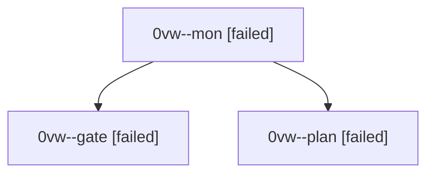

# Session: 0vw

[Agent Hoods](../README.md) / [bbugyi200](../users/bbugyi200/README.md) / [athena](../users/bbugyi200/machines/athena/README.md) / [0vw](../users/bbugyi200/machines/athena/hoods/0vw/README.md) / 0vw

Owner: `bbugyi200.athena` · Hood: `0vw` · Members: 3

## Lineage

The diagram is an optional enhancement; the ordered table below contains the same lineage in accessible text.

| Role | Agent | State | Model / provider | Timing | Commits | Prompt | Chat |
|---|---|---|---|---|---:|---|---|
| mon | 0vw--mon | failed | gpt-6.1-sol / codex | 2026-10-03T20:24:13.198472+00:00 → 2026-10-03T20:27:14.874254+00:00 | 0 | — | [Chat](../agents/bbugyi200.athena.0vw--mon/chat.md) |
| gate | 0vw--gate | failed | gpt-6.1-sol / codex | 2026-10-03T20:23:11.166124+00:00 → 2026-10-03T20:24:13.843176+00:00 | 0 | — | [Chat](../agents/bbugyi200.athena.0vw--gate/chat.md) |
| plan | 0vw--plan | failed | gpt-6.1-sol / codex | 2026-10-03T20:12:26.353398+00:00 → 2026-10-03T20:24:17.795884+00:00 | 0 | [Prompt](../agents/bbugyi200.athena.0vw--plan/prompt.md) | [Chat](../agents/bbugyi200.athena.0vw--plan/chat.md) |
