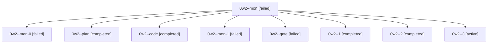

# Session: 0w2

[Agent Hoods](../README.md) / [bbugyi200](../users/bbugyi200/README.md) / [athena](../users/bbugyi200/machines/athena/README.md) / [0w2](../users/bbugyi200/machines/athena/hoods/0w2/README.md) / 0w2

Owner: `bbugyi200.athena` · Hood: `0w2` · Members: 9

## Lineage

The diagram is an optional enhancement; the ordered table below contains the same lineage in accessible text.

| Role | Agent | State | Model / provider | Timing | Commits | Prompt | Chat |
|---|---|---|---|---|---:|---|---|
| mon | 0w2--mon | failed | gpt-6-luna / codex | 2026-10-04T09:56:39.173079+00:00 → 2026-10-04T09:59:46.054352+00:00 | 0 | — | [Chat](../agents/bbugyi200.athena.0w2--mon/chat.md) |
| mon-0 | 0w2--mon-0 | failed | gpt-6-luna / codex | 2026-10-04T10:06:15.693770+00:00 → 2026-10-04T10:08:16.184944+00:00 | 0 | — | [Chat](../agents/bbugyi200.athena.0w2--mon-0/chat.md) |
| plan | 0w2--plan | completed | opus / claude | 2026-10-04T09:24:03.394900+00:00 → 2026-10-04T09:57:05.998223+00:00 | 0 | [Prompt](../agents/bbugyi200.athena.0w2--plan/prompt.md) | [Chat](../agents/bbugyi200.athena.0w2--plan/chat.md) |
| code | 0w2--code | completed | gpt-6-luna / codex | 2026-10-04T09:47:41.971878+00:00 → 2026-10-04T09:57:05.998223+00:00 | 0 | — | [Chat](../agents/bbugyi200.athena.0w2--code/chat.md) |
| mon-1 | 0w2--mon-1 | failed | gpt-6-luna / codex | 2026-10-04T10:17:40.289041+00:00 → 2026-10-04T10:20:33.700204+00:00 | 0 | — | [Chat](../agents/bbugyi200.athena.0w2--mon-1/chat.md) |
| gate | 0w2--gate | failed | opus / claude | 2026-10-04T09:47:08.316339+00:00 → 2026-10-04T09:47:27.791395+00:00 | 0 | — | [Chat](../agents/bbugyi200.athena.0w2--gate/chat.md) |
| 1 | 0w2--1 | completed | gpt-6-luna / codex | 2026-10-04T09:59:58.613797+00:00 → 2026-10-04T10:06:39.944762+00:00 | 0 | [Prompt](../agents/bbugyi200.athena.0w2--1/prompt.md) | [Chat](../agents/bbugyi200.athena.0w2--1/chat.md) |
| 2 | 0w2--2 | completed | gpt-6-luna / codex | 2026-10-04T10:08:26.911653+00:00 → 2026-10-04T10:18:05.447138+00:00 | 0 | [Prompt](../agents/bbugyi200.athena.0w2--2/prompt.md) | [Chat](../agents/bbugyi200.athena.0w2--2/chat.md) |
| 3 | 0w2--3 | active | gpt-6-luna / codex | 2026-10-04T10:20:50.004213+00:00 | 0 | [Prompt](../agents/bbugyi200.athena.0w2--3/prompt.md) | — |
