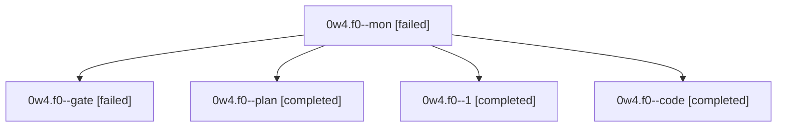

# Session: 0w4.f0

[Agent Hoods](../README.md) / [bbugyi200](../users/bbugyi200/README.md) / [athena](../users/bbugyi200/machines/athena/README.md) / [0w4](../users/bbugyi200/machines/athena/hoods/0w4/README.md) / 0w4.f0

Owner: `bbugyi200.athena` · Hood: `0w4` · Members: 5

## Lineage

The diagram is an optional enhancement; the ordered table below contains the same lineage in accessible text.

| Role | Agent | State | Model / provider | Timing | Commits | Prompt | Chat |
|---|---|---|---|---|---:|---|---|
| mon | 0w4.f0--mon | failed | grok-4.6 / grok | 2026-10-04T10:44:32.264313+00:00 → 2026-10-04T10:47:24.652503+00:00 | 0 | — | [Chat](../agents/bbugyi200.athena.0w4.f0--mon/chat.md) |
| gate | 0w4.f0--gate | failed | gpt-6.1-sol / codex | 2026-10-04T10:25:02.069609+00:00 → 2026-10-04T10:25:29.637783+00:00 | 0 | — | [Chat](../agents/bbugyi200.athena.0w4.f0--gate/chat.md) |
| plan | 0w4.f0--plan | completed | gpt-6.1-sol / codex | 2026-10-04T10:14:59.021685+00:00 → 2026-10-04T10:45:06.972108+00:00 | 0 | [Prompt](../agents/bbugyi200.athena.0w4.f0--plan/prompt.md) | [Chat](../agents/bbugyi200.athena.0w4.f0--plan/chat.md) |
| 1 | 0w4.f0--1 | completed | grok-4.6 / grok | 2026-10-04T10:47:49.114711+00:00 → 2026-10-04T11:01:35.255753+00:00 | [1](../agents/bbugyi200.athena.0w4.f0--1/README.md#commits) | [Prompt](../agents/bbugyi200.athena.0w4.f0--1/prompt.md) | [Chat](../agents/bbugyi200.athena.0w4.f0--1/chat.md) |
| code | 0w4.f0--code | completed | grok-4.6 / grok | 2026-10-04T10:25:45.422805+00:00 → 2026-10-04T10:45:06.972108+00:00 | 0 | — | [Chat](../agents/bbugyi200.athena.0w4.f0--code/chat.md) |

## Commits

| Role | Repo | Commit | Subject | Committed |
|---|---|---|---|---|
| 1 | bob-cli | [`fc438bc`](https://github.com/bobs-org/bob-cli/commit/fc438bcf602a738360691f66269f0547af8cf201) | feat(freshness): drop the October 19 decay trial date | 2026-10-04 06:59:59 EDT |

## Neighbors

| Agent | Relation | State |
|---|---|---|
| [0w4](bbugyi200.athena.0w4.md) (session · 3) | ancestor | completed 2, failed 1 |
| [0w4.f1](bbugyi200.athena.0w4.f1.md) (session · 3) | 0w4 hood | completed 2, failed 1 |
| [0w4.f2](../agents/bbugyi200.athena.0w4.f2/README.md) | 0w4 hood | active |
| [0w4.f3](bbugyi200.athena.0w4.f3.md) (session · 3) | 0w4 hood | active 2, failed 1 |
