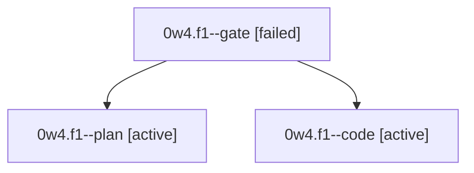

# Session: 0w4.f1

[Agent Hoods](../README.md) / [bbugyi200](../users/bbugyi200/README.md) / [athena](../users/bbugyi200/machines/athena/README.md) / [0w4](../users/bbugyi200/machines/athena/hoods/0w4/README.md) / 0w4.f1

Owner: `bbugyi200.athena` · Hood: `0w4` · Members: 3

## Lineage

The diagram is an optional enhancement; the ordered table below contains the same lineage in accessible text.

| Role | Agent | State | Model / provider | Timing | Commits | Prompt | Chat |
|---|---|---|---|---|---:|---|---|
| gate | 0w4.f1--gate | failed | opus / claude | 2026-10-04T10:34:35.904448+00:00 → 2026-10-04T10:35:12.907035+00:00 | 0 | — | [Chat](../agents/bbugyi200.athena.0w4.f1--gate/chat.md) |
| plan | 0w4.f1--plan | active | opus / claude | 2026-10-04T10:15:22.754959+00:00 | 0 | [Prompt](../agents/bbugyi200.athena.0w4.f1--plan/prompt.md) | [Chat](../agents/bbugyi200.athena.0w4.f1--plan/chat.md) |
| code | 0w4.f1--code | active | gpt-6-luna / codex | 2026-10-04T10:35:19.401015+00:00 | [1](../agents/bbugyi200.athena.0w4.f1--code/README.md#commits) | — | — |

## Commits

| Role | Repo | Commit | Subject | Committed |
|---|---|---|---|---|
| code | bob-cli | [`e09c11b`](https://github.com/bobs-org/bob-cli/commit/e09c11bb4c17f62b5cffb1c1b6444f69474dd439) | docs(task-card): clarify close and scheduling behavior | 2026-10-04 07:03:47 EDT |

## Neighbors

| Agent | Relation | State |
|---|---|---|
| [0w4](bbugyi200.athena.0w4.md) (session · 3) | ancestor | completed 2, failed 1 |
| [0w4.f0](bbugyi200.athena.0w4.f0.md) (session · 5) | 0w4 hood | completed 3, failed 2 |
