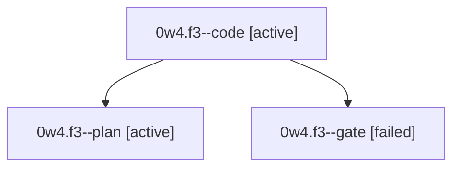

# Session: 0w4.f3

[Agent Hoods](../README.md) / [bbugyi200](../users/bbugyi200/README.md) / [athena](../users/bbugyi200/machines/athena/README.md) / [0w4](../users/bbugyi200/machines/athena/hoods/0w4/README.md) / 0w4.f3

Owner: `bbugyi200.athena` · Hood: `0w4` · Members: 3

## Lineage

The diagram is an optional enhancement; the ordered table below contains the same lineage in accessible text.

| Role | Agent | State | Model / provider | Timing | Commits | Prompt | Chat |
|---|---|---|---|---|---:|---|---|
| code | 0w4.f3--code | active | grok-4.6 / grok | 2026-10-04T14:31:34.249857+00:00 | [1](../agents/bbugyi200.athena.0w4.f3--code/README.md#commits) | — | — |
| plan | 0w4.f3--plan | active | gpt-6.1-sol / codex | 2026-10-04T14:20:57.529132+00:00 | 0 | [Prompt](../agents/bbugyi200.athena.0w4.f3--plan/prompt.md) | [Chat](../agents/bbugyi200.athena.0w4.f3--plan/chat.md) |
| gate | 0w4.f3--gate | failed | gpt-6.1-sol / codex | 2026-10-04T14:28:17.102448+00:00 → 2026-10-04T14:29:47.801142+00:00 | 0 | — | [Chat](../agents/bbugyi200.athena.0w4.f3--gate/chat.md) |

## Commits

| Role | Repo | Commit | Subject | Committed |
|---|---|---|---|---|
| code | bob-cli | [`b5a8ac2`](https://github.com/bobs-org/bob-cli/commit/b5a8ac20749ec1d8ef1e0e97dd2c8e695d07bcc3) | docs(projects): advertise Task Card close as Ctrl+\[ | 2026-10-04 10:40:18 EDT |

## Neighbors

| Agent | Relation | State |
|---|---|---|
| [0w4](bbugyi200.athena.0w4.md) (session · 3) | ancestor | completed 2, failed 1 |
| [0w4.f0](bbugyi200.athena.0w4.f0.md) (session · 5) | 0w4 hood | completed 3, failed 2 |
| [0w4.f1](bbugyi200.athena.0w4.f1.md) (session · 3) | 0w4 hood | completed 2, failed 1 |
| [0w4.f2](../agents/bbugyi200.athena.0w4.f2/README.md) | 0w4 hood | active |
