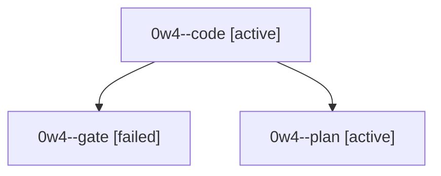

# Session: 0w4

[Agent Hoods](../README.md) / [bbugyi200](../users/bbugyi200/README.md) / [athena](../users/bbugyi200/machines/athena/README.md) / [0w4](../users/bbugyi200/machines/athena/hoods/0w4/README.md) / 0w4

Owner: `bbugyi200.athena` · Hood: `0w4` · Members: 3

## Lineage

The diagram is an optional enhancement; the ordered table below contains the same lineage in accessible text.

| Role | Agent | State | Model / provider | Timing | Commits | Prompt | Chat |
|---|---|---|---|---|---:|---|---|
| code | 0w4--code | active | sonnet / claude | 2026-10-04T09:43:50.643165+00:00 | 0 | — | — |
| gate | 0w4--gate | failed | grok-4.7 / grok | 2026-10-04T09:43:15.693766+00:00 → 2026-10-04T09:43:37.135825+00:00 | 0 | — | [Chat](../agents/bbugyi200.athena.0w4--gate/chat.md) |
| plan | 0w4--plan | active | grok-4.7 / grok | 2026-10-04T09:33:58.484979+00:00 | 0 | [Prompt](../agents/bbugyi200.athena.0w4--plan/prompt.md) | [Chat](../agents/bbugyi200.athena.0w4--plan/chat.md) |

## Neighbors

| Agent | Relation | State |
|---|---|---|
| [0w4.f0](../agents/bbugyi200.athena.0w4.f0/README.md) | descendant | waiting |
| [0w4.f1](../agents/bbugyi200.athena.0w4.f1/README.md) | descendant | waiting |
