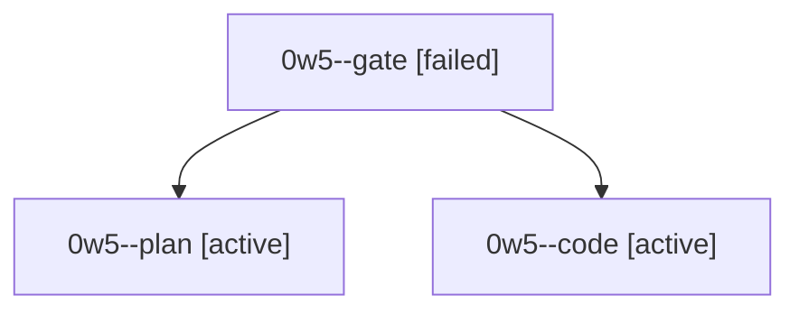

# Session: 0w5

[Agent Hoods](../README.md) / [bbugyi200](../users/bbugyi200/README.md) / [athena](../users/bbugyi200/machines/athena/README.md) / [0w5](../users/bbugyi200/machines/athena/hoods/0w5/README.md) / 0w5

Owner: `bbugyi200.athena` · Hood: `0w5` · Members: 3

## Lineage

The diagram is an optional enhancement; the ordered table below contains the same lineage in accessible text.

| Role | Agent | State | Model / provider | Timing | Commits | Prompt | Chat |
|---|---|---|---|---|---:|---|---|
| gate | 0w5--gate | failed | opus / claude | 2026-10-04T10:02:23.534138+00:00 → 2026-10-04T10:02:44.787388+00:00 | 0 | — | [Chat](../agents/bbugyi200.athena.0w5--gate/chat.md) |
| plan | 0w5--plan | active | opus / claude | 2026-10-04T09:58:50.874206+00:00 | 0 | [Prompt](../agents/bbugyi200.athena.0w5--plan/prompt.md) | [Chat](../agents/bbugyi200.athena.0w5--plan/chat.md) |
| code | 0w5--code | active | sonnet / claude | 2026-10-04T10:02:58.854032+00:00 | 0 | — | — |
