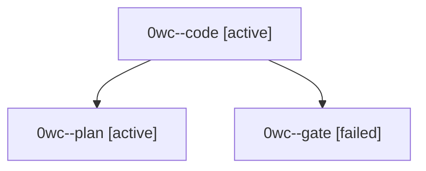

# Session: 0wc

[Agent Hoods](../README.md) / [bbugyi200](../users/bbugyi200/README.md) / [athena](../users/bbugyi200/machines/athena/README.md) / [0wc](../users/bbugyi200/machines/athena/hoods/0wc/README.md) / 0wc

Owner: `bbugyi200.athena` · Hood: `0wc` · Members: 3

## Lineage

The diagram is an optional enhancement; the ordered table below contains the same lineage in accessible text.

| Role | Agent | State | Model / provider | Timing | Commits | Prompt | Chat |
|---|---|---|---|---|---:|---|---|
| code | 0wc--code | active | grok-4.6 / grok | 2026-10-04T13:25:47.385962+00:00 | 0 | — | — |
| plan | 0wc--plan | active | opus / claude | 2026-10-04T13:06:33.059170+00:00 | 0 | [Prompt](../agents/bbugyi200.athena.0wc--plan/prompt.md) | [Chat](../agents/bbugyi200.athena.0wc--plan/chat.md) |
| gate | 0wc--gate | failed | opus / claude | 2026-10-04T13:24:58.377049+00:00 → 2026-10-04T13:25:32.421321+00:00 | 0 | — | [Chat](../agents/bbugyi200.athena.0wc--gate/chat.md) |
