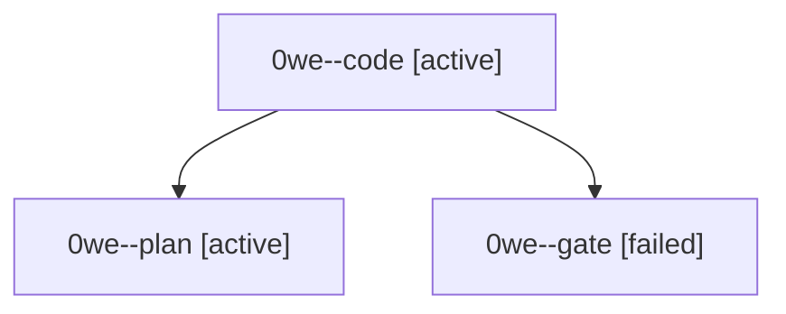

# Session: 0we

[Agent Hoods](../README.md) / [bbugyi200](../users/bbugyi200/README.md) / [athena](../users/bbugyi200/machines/athena/README.md) / [0we](../users/bbugyi200/machines/athena/hoods/0we/README.md) / 0we

Owner: `bbugyi200.athena` · Hood: `0we` · Members: 3

## Lineage

The diagram is an optional enhancement; the ordered table below contains the same lineage in accessible text.

| Role | Agent | State | Model / provider | Timing | Commits | Prompt | Chat |
|---|---|---|---|---|---:|---|---|
| code | 0we--code | active | gpt-6-luna / codex | 2026-10-04T14:34:43.077141+00:00 | 0 | — | — |
| plan | 0we--plan | active | opus / claude | 2026-10-04T14:19:11.899298+00:00 | 0 | [Prompt](../agents/bbugyi200.athena.0we--plan/prompt.md) | [Chat](../agents/bbugyi200.athena.0we--plan/chat.md) |
| gate | 0we--gate | failed | opus / claude | 2026-10-04T14:31:35.248944+00:00 → 2026-10-04T14:32:43.939064+00:00 | 0 | — | [Chat](../agents/bbugyi200.athena.0we--gate/chat.md) |
