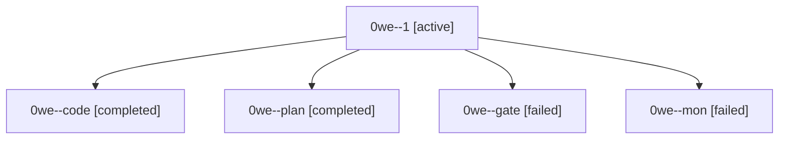

# Session: 0we

[Agent Hoods](../README.md) / [bbugyi200](../users/bbugyi200/README.md) / [athena](../users/bbugyi200/machines/athena/README.md) / [0we](../users/bbugyi200/machines/athena/hoods/0we/README.md) / 0we

Owner: `bbugyi200.athena` · Hood: `0we` · Members: 5

## Lineage

The diagram is an optional enhancement; the ordered table below contains the same lineage in accessible text.

| Role | Agent | State | Model / provider | Timing | Commits | Prompt | Chat |
|---|---|---|---|---|---:|---|---|
| 1 | 0we--1 | active | gpt-6-luna / codex | 2026-10-04T14:55:09.860539+00:00 | [1](../agents/bbugyi200.athena.0we--1/README.md#commits) | [Prompt](../agents/bbugyi200.athena.0we--1/prompt.md) | — |
| code | 0we--code | completed | gpt-6-luna / codex | 2026-10-04T14:34:43.077141+00:00 → 2026-10-04T14:51:29.495687+00:00 | 0 | — | [Chat](../agents/bbugyi200.athena.0we--code/chat.md) |
| plan | 0we--plan | completed | opus / claude | 2026-10-04T14:19:11.899298+00:00 → 2026-10-04T14:51:29.495687+00:00 | 0 | [Prompt](../agents/bbugyi200.athena.0we--plan/prompt.md) | [Chat](../agents/bbugyi200.athena.0we--plan/chat.md) |
| gate | 0we--gate | failed | opus / claude | 2026-10-04T14:31:35.248944+00:00 → 2026-10-04T14:32:43.939064+00:00 | 0 | — | [Chat](../agents/bbugyi200.athena.0we--gate/chat.md) |
| mon | 0we--mon | failed | gpt-6-luna / codex | 2026-10-04T14:50:45.502055+00:00 → 2026-10-04T14:54:29.929304+00:00 | 0 | — | [Chat](../agents/bbugyi200.athena.0we--mon/chat.md) |

## Commits

| Role | Repo | Commit | Subject | Committed |
|---|---|---|---|---|
| 1 | bob-cli | [`2af9fbe`](https://github.com/bobs-org/bob-cli/commit/2af9fbe52843042fb743a35bf3c6ecfe28b4edc9) | feat(install-all): add coordinated install workflow | 2026-10-04 11:37:26 EDT |
