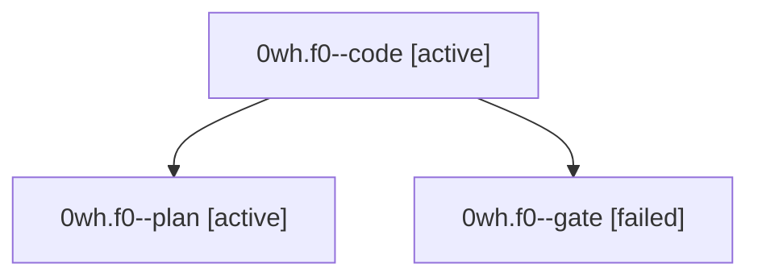

# Session: 0wh.f0

[Agent Hoods](../README.md) / [bbugyi200](../users/bbugyi200/README.md) / [athena](../users/bbugyi200/machines/athena/README.md) / [0wh](../users/bbugyi200/machines/athena/hoods/0wh/README.md) / 0wh.f0

Owner: `bbugyi200.athena` · Hood: `0wh` · Members: 3

## Lineage

The diagram is an optional enhancement; the ordered table below contains the same lineage in accessible text.

| Role | Agent | State | Model / provider | Timing | Commits | Prompt | Chat |
|---|---|---|---|---|---:|---|---|
| code | 0wh.f0--code | active | grok-4.6 / grok | 2026-10-04T18:29:03.407007+00:00 | 0 | — | — |
| plan | 0wh.f0--plan | active | grok-4.7 / grok | 2026-10-04T18:20:25.221651+00:00 | 0 | [Prompt](../agents/bbugyi200.athena.0wh.f0--plan/prompt.md) | [Chat](../agents/bbugyi200.athena.0wh.f0--plan/chat.md) |
| gate | 0wh.f0--gate | failed | grok-4.7 / grok | 2026-10-04T18:28:26.370430+00:00 → 2026-10-04T18:28:46.421129+00:00 | 0 | — | [Chat](../agents/bbugyi200.athena.0wh.f0--gate/chat.md) |

## Neighbors

| Agent | Relation | State |
|---|---|---|
| [0wh](bbugyi200.athena.0wh.md) (session · 3) | ancestor | completed 2, failed 1 |
