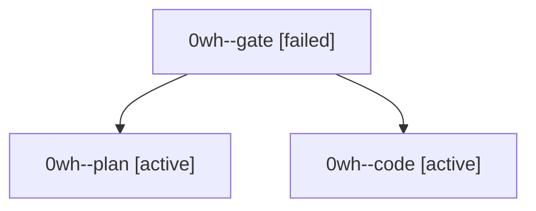

# Session: 0wh

[Agent Hoods](../README.md) / [bbugyi200](../users/bbugyi200/README.md) / [athena](../users/bbugyi200/machines/athena/README.md) / [0wh](../users/bbugyi200/machines/athena/hoods/0wh/README.md) / 0wh

Owner: `bbugyi200.athena` · Hood: `0wh` · Members: 3

## Lineage

The diagram is an optional enhancement; the ordered table below contains the same lineage in accessible text.

| Role | Agent | State | Model / provider | Timing | Commits | Prompt | Chat |
|---|---|---|---|---|---:|---|---|
| gate | 0wh--gate | failed | opus / claude | 2026-10-04T17:57:24.997610+00:00 → 2026-10-04T17:58:18.314828+00:00 | 0 | — | [Chat](../agents/bbugyi200.athena.0wh--gate/chat.md) |
| plan | 0wh--plan | active | opus / claude | 2026-10-04T17:50:12.705968+00:00 | 0 | [Prompt](../agents/bbugyi200.athena.0wh--plan/prompt.md) | [Chat](../agents/bbugyi200.athena.0wh--plan/chat.md) |
| code | 0wh--code | active | grok-4.6 / grok | 2026-10-04T17:58:33.028068+00:00 | 0 | — | — |

## Neighbors

| Agent | Relation | State |
|---|---|---|
| [0wh.f0](../agents/bbugyi200.athena.0wh.f0/README.md) | descendant | waiting |
