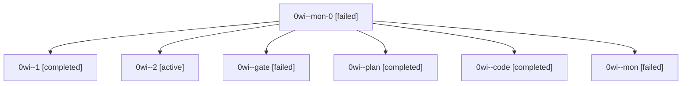

# Session: 0wi

[Agent Hoods](../README.md) / [bbugyi200](../users/bbugyi200/README.md) / [athena](../users/bbugyi200/machines/athena/README.md) / [0wi](../users/bbugyi200/machines/athena/hoods/0wi/README.md) / 0wi

Owner: `bbugyi200.athena` · Hood: `0wi` · Members: 7

## Lineage

The diagram is an optional enhancement; the ordered table below contains the same lineage in accessible text.

| Role | Agent | State | Model / provider | Timing | Commits | Prompt | Chat |
|---|---|---|---|---|---:|---|---|
| mon-0 | 0wi--mon-0 | failed | gpt-6-luna / codex | 2026-10-04T19:36:15.777431+00:00 → 2026-10-04T19:38:21.374849+00:00 | 0 | — | [Chat](../agents/bbugyi200.athena.0wi--mon-0/chat.md) |
| 1 | 0wi--1 | completed | gpt-6-luna / codex | 2026-10-04T19:30:38.013549+00:00 → 2026-10-04T19:36:52.188982+00:00 | 0 | [Prompt](../agents/bbugyi200.athena.0wi--1/prompt.md) | [Chat](../agents/bbugyi200.athena.0wi--1/chat.md) |
| 2 | 0wi--2 | active | gpt-6-luna / codex | 2026-10-04T19:38:44.815497+00:00 | [1](../agents/bbugyi200.athena.0wi--2/README.md#commits) | [Prompt](../agents/bbugyi200.athena.0wi--2/prompt.md) | — |
| gate | 0wi--gate | failed | opus / claude | 2026-10-04T18:49:51.675358+00:00 → 2026-10-04T18:50:12.316824+00:00 | 0 | — | [Chat](../agents/bbugyi200.athena.0wi--gate/chat.md) |
| plan | 0wi--plan | completed | opus / claude | 2026-10-04T18:32:21.086155+00:00 → 2026-10-04T19:28:00.869802+00:00 | 0 | [Prompt](../agents/bbugyi200.athena.0wi--plan/prompt.md) | [Chat](../agents/bbugyi200.athena.0wi--plan/chat.md) |
| code | 0wi--code | completed | gpt-6-luna / codex | 2026-10-04T18:50:26.802748+00:00 → 2026-10-04T19:28:00.869802+00:00 | 0 | — | [Chat](../agents/bbugyi200.athena.0wi--code/chat.md) |
| mon | 0wi--mon | failed | gpt-6-luna / codex | 2026-10-04T19:27:11.302388+00:00 → 2026-10-04T19:30:07.450206+00:00 | 0 | — | [Chat](../agents/bbugyi200.athena.0wi--mon/chat.md) |

## Commits

| Role | Repo | Commit | Subject | Committed |
|---|---|---|---|---|
| 2 | bob-cli | [`346222f`](https://github.com/bobs-org/bob-cli/commit/346222fa7afe12bb90df8cf18bd055f23652fef5) | docs(review): document Ctrl+Enter checklist walking | 2026-10-04 15:42:34 EDT |
