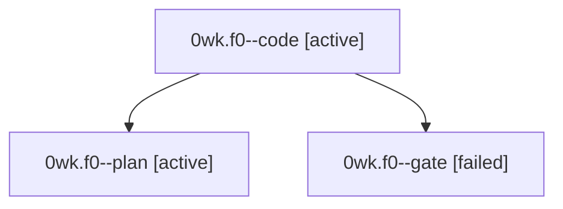

# Session: 0wk.f0

[Agent Hoods](../README.md) / [bbugyi200](../users/bbugyi200/README.md) / [athena](../users/bbugyi200/machines/athena/README.md) / [0wk](../users/bbugyi200/machines/athena/hoods/0wk/README.md) / 0wk.f0

Owner: `bbugyi200.athena` · Hood: `0wk` · Members: 3

## Lineage

The diagram is an optional enhancement; the ordered table below contains the same lineage in accessible text.

| Role | Agent | State | Model / provider | Timing | Commits | Prompt | Chat |
|---|---|---|---|---|---:|---|---|
| code | 0wk.f0--code | active | grok-4.6 / grok | 2026-10-04T22:36:32.036798+00:00 | [1](../agents/bbugyi200.athena.0wk.f0--code/README.md#commits) | — | — |
| plan | 0wk.f0--plan | active | opus / claude | 2026-10-04T22:27:16.497385+00:00 | 0 | [Prompt](../agents/bbugyi200.athena.0wk.f0--plan/prompt.md) | [Chat](../agents/bbugyi200.athena.0wk.f0--plan/chat.md) |
| gate | 0wk.f0--gate | failed | opus / claude | 2026-10-04T22:35:56.439361+00:00 → 2026-10-04T22:36:17.379431+00:00 | 0 | — | [Chat](../agents/bbugyi200.athena.0wk.f0--gate/chat.md) |

## Commits

| Role | Repo | Commit | Subject | Committed |
|---|---|---|---|---|
| code | bob-cli | [`d8fc07a`](https://github.com/bobs-org/bob-cli/commit/d8fc07a1f1ba8da828bbac8888ec25e196214d96) | docs(memory): add Mac Menu Bar Pomodoro Indicator glossary term | 2026-10-04 18:39:53 EDT |

## Neighbors

| Agent | Relation | State |
|---|---|---|
| [0wk](bbugyi200.athena.0wk.md) (session · 3) | ancestor | completed 2, failed 1 |
