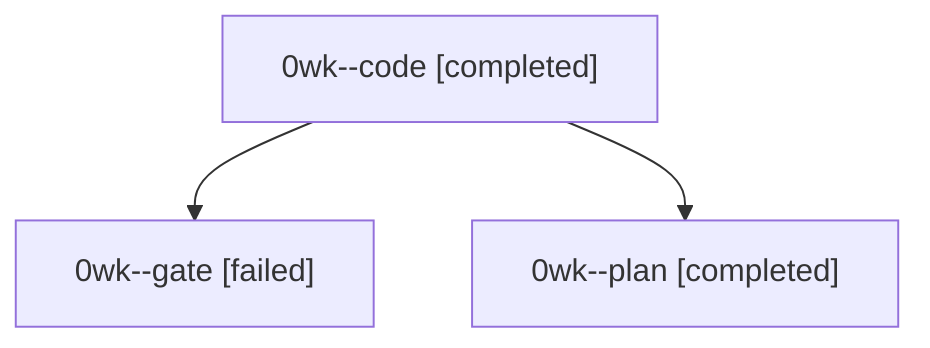

# Session: 0wk

[Agent Hoods](../README.md) / [bbugyi200](../users/bbugyi200/README.md) / [athena](../users/bbugyi200/machines/athena/README.md) / [0wk](../users/bbugyi200/machines/athena/hoods/0wk/README.md) / 0wk

Owner: `bbugyi200.athena` · Hood: `0wk` · Members: 3

## Lineage

The diagram is an optional enhancement; the ordered table below contains the same lineage in accessible text.

| Role | Agent | State | Model / provider | Timing | Commits | Prompt | Chat |
|---|---|---|---|---|---:|---|---|
| code | 0wk--code | completed | grok-4.6 / grok | 2026-10-04T22:15:14.541249+00:00 → 2026-10-04T22:26:08.569712+00:00 | 0 | — | [Chat](../agents/bbugyi200.athena.0wk--code/chat.md) |
| gate | 0wk--gate | failed | opus / claude | 2026-10-04T22:14:38.386735+00:00 → 2026-10-04T22:15:00.462438+00:00 | 0 | — | [Chat](../agents/bbugyi200.athena.0wk--gate/chat.md) |
| plan | 0wk--plan | completed | opus / claude | 2026-10-04T22:08:17.198998+00:00 → 2026-10-04T22:26:08.569712+00:00 | 0 | [Prompt](../agents/bbugyi200.athena.0wk--plan/prompt.md) | [Chat](../agents/bbugyi200.athena.0wk--plan/chat.md) |

## Neighbors

| Agent | Relation | State |
|---|---|---|
| [0wk.f0](bbugyi200.athena.0wk.f0.md) (session · 3) | descendant | active 2, failed 1 |
