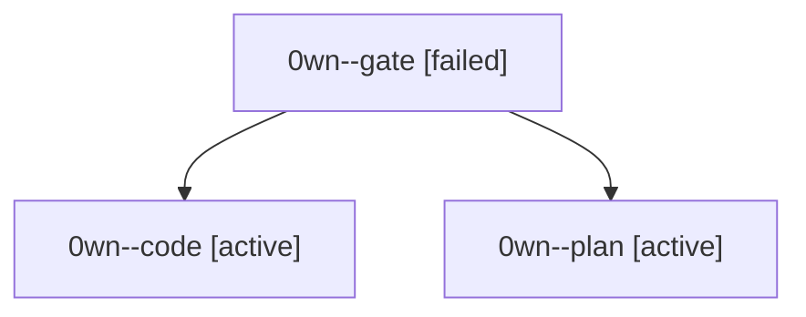

# Session: 0wn

[Agent Hoods](../README.md) / [bbugyi200](../users/bbugyi200/README.md) / [athena](../users/bbugyi200/machines/athena/README.md) / [0wn](../users/bbugyi200/machines/athena/hoods/0wn/README.md) / 0wn

Owner: `bbugyi200.athena` · Hood: `0wn` · Members: 3

## Lineage

The diagram is an optional enhancement; the ordered table below contains the same lineage in accessible text.

| Role | Agent | State | Model / provider | Timing | Commits | Prompt | Chat |
|---|---|---|---|---|---:|---|---|
| gate | 0wn--gate | failed | grok-4.7 / grok | 2026-10-05T11:42:19.588624+00:00 → 2026-10-05T11:42:40.278347+00:00 | 0 | — | [Chat](../agents/bbugyi200.athena.0wn--gate/chat.md) |
| code | 0wn--code | active | muse-spark-1.3-contributor / muse | 2026-10-05T11:42:57.386010+00:00 | 0 | — | — |
| plan | 0wn--plan | active | grok-4.7 / grok | 2026-10-05T11:35:58.676265+00:00 | 0 | [Prompt](../agents/bbugyi200.athena.0wn--plan/prompt.md) | [Chat](../agents/bbugyi200.athena.0wn--plan/chat.md) |
