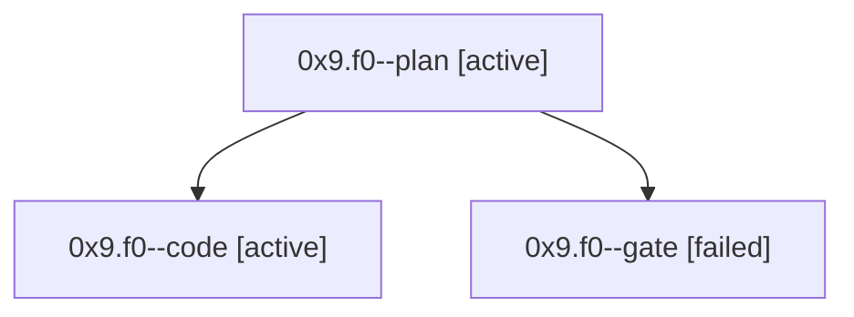

# Session: 0x9.f0

[Agent Hoods](../README.md) / [bbugyi200](../users/bbugyi200/README.md) / [athena](../users/bbugyi200/machines/athena/README.md) / [0x9](../users/bbugyi200/machines/athena/hoods/0x9/README.md) / 0x9.f0

Owner: `bbugyi200.athena` · Hood: `0x9` · Members: 3

## Lineage

The diagram is an optional enhancement; the ordered table below contains the same lineage in accessible text.

| Role | Agent | State | Model / provider | Timing | Commits | Prompt | Chat |
|---|---|---|---|---|---:|---|---|
| plan | 0x9.f0--plan | active | opus / claude | 2026-10-06T14:18:49.929523+00:00 | 0 | [Prompt](../agents/bbugyi200.athena.0x9.f0--plan/prompt.md) | [Chat](../agents/bbugyi200.athena.0x9.f0--plan/chat.md) |
| code | 0x9.f0--code | active | muse-spark-1.3-contributor / muse | 2026-10-06T14:33:30.843434+00:00 | [1](../agents/bbugyi200.athena.0x9.f0--code/README.md#commits) | — | — |
| gate | 0x9.f0--gate | failed | opus / claude | 2026-10-06T14:32:54.910598+00:00 → 2026-10-06T14:33:15.538586+00:00 | 0 | — | [Chat](../agents/bbugyi200.athena.0x9.f0--gate/chat.md) |

## Commits

| Role | Repo | Commit | Subject | Committed |
|---|---|---|---|---|
| code | bob-cli | [`a3427dc`](https://github.com/bobs-org/bob-cli/commit/a3427dc201f3cf5ea5dfbbaa89a317f259658a4b) | docs(freshness): review walk keeps queue order across line shifts (nav 2.7.1) | 2026-10-06 10:44:08 EDT |

## Neighbors

| Agent | Relation | State |
|---|---|---|
| [0x9](bbugyi200.athena.0x9.md) (session · 5) | ancestor | active 1, completed 2, failed 2 |
