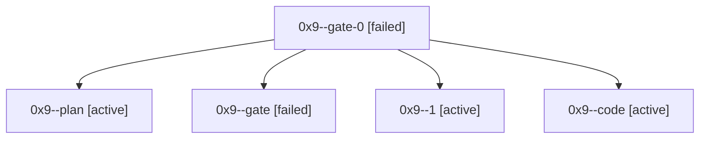

# Session: 0x9

[Agent Hoods](../README.md) / [bbugyi200](../users/bbugyi200/README.md) / [athena](../users/bbugyi200/machines/athena/README.md) / [0x9](../users/bbugyi200/machines/athena/hoods/0x9/README.md) / 0x9

Owner: `bbugyi200.athena` · Hood: `0x9` · Members: 5

## Lineage

The diagram is an optional enhancement; the ordered table below contains the same lineage in accessible text.

| Role | Agent | State | Model / provider | Timing | Commits | Prompt | Chat |
|---|---|---|---|---|---:|---|---|
| gate-0 | 0x9--gate-0 | failed | opus / claude | 2026-10-06T13:36:38.158297+00:00 → 2026-10-06T13:36:58.937418+00:00 | 0 | — | [Chat](../agents/bbugyi200.athena.0x9--gate-0/chat.md) |
| plan | 0x9--plan | active | opus / claude | 2026-10-06T13:20:51.820356+00:00 | 0 | [Prompt](../agents/bbugyi200.athena.0x9--plan/prompt.md) | [Chat](../agents/bbugyi200.athena.0x9--plan/chat.md) |
| gate | 0x9--gate | failed | opus / claude | 2026-10-06T13:28:41.978822+00:00 → 2026-10-06T13:28:58.832685+00:00 | 0 | — | [Chat](../agents/bbugyi200.athena.0x9--gate/chat.md) |
| 1 | 0x9--1 | active | opus / claude | 2026-10-06T13:29:12.849029+00:00 | 0 | — | [Chat](../agents/bbugyi200.athena.0x9--1/chat.md) |
| code | 0x9--code | active | muse-spark-1.3-contributor / muse | 2026-10-06T13:37:00.302831+00:00 | [1](../agents/bbugyi200.athena.0x9--code/README.md#commits) | — | — |

## Commits

| Role | Repo | Commit | Subject | Committed |
|---|---|---|---|---|
| code | bob-cli | [`841b1c0`](https://github.com/bobs-org/bob-cli/commit/841b1c0ee198d53f35edbc421988761fd4e5799e) | docs(review): Ctrl+Shift+M never advances the walk; move parks and \]s resumes at the moved row's neighbour | 2026-10-06 09:49:45 EDT |
