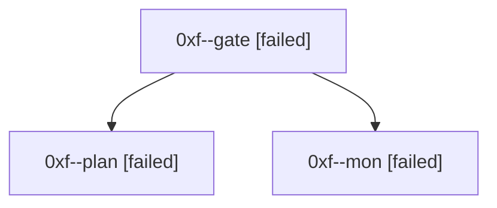

# Session: 0xf

[Agent Hoods](../README.md) / [bbugyi200](../users/bbugyi200/README.md) / [athena](../users/bbugyi200/machines/athena/README.md) / [0xf](../users/bbugyi200/machines/athena/hoods/0xf/README.md) / 0xf

Owner: `bbugyi200.athena` · Hood: `0xf` · Members: 3

## Lineage

The diagram is an optional enhancement; the ordered table below contains the same lineage in accessible text.

| Role | Agent | State | Model / provider | Timing | Commits | Prompt | Chat |
|---|---|---|---|---|---:|---|---|
| gate | 0xf--gate | failed | opus / claude | 2026-10-06T17:50:21.217922+00:00 → 2026-10-06T17:50:47.203777+00:00 | 0 | — | [Chat](../agents/bbugyi200.athena.0xf--gate/chat.md) |
| plan | 0xf--plan | failed | opus / claude | 2026-10-06T17:36:13.842533+00:00 → 2026-10-06T17:50:52.358729+00:00 | 0 | [Prompt](../agents/bbugyi200.athena.0xf--plan/prompt.md) | [Chat](../agents/bbugyi200.athena.0xf--plan/chat.md) |
| mon | 0xf--mon | failed | opus / claude | 2026-10-06T17:50:46.310858+00:00 → 2026-10-06T17:53:18.314220+00:00 | 0 | — | [Chat](../agents/bbugyi200.athena.0xf--mon/chat.md) |
