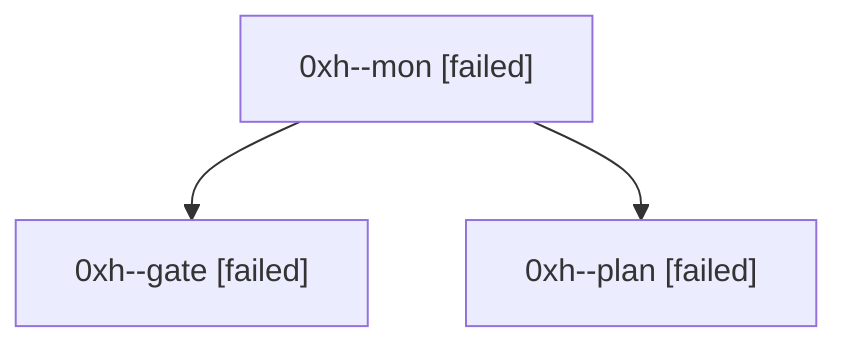

# Session: 0xh

[Agent Hoods](../README.md) / [bbugyi200](../users/bbugyi200/README.md) / [athena](../users/bbugyi200/machines/athena/README.md) / [0xh](../users/bbugyi200/machines/athena/hoods/0xh/README.md) / 0xh

Owner: `bbugyi200.athena` · Hood: `0xh` · Members: 3

## Lineage

The diagram is an optional enhancement; the ordered table below contains the same lineage in accessible text.

| Role | Agent | State | Model / provider | Timing | Commits | Prompt | Chat |
|---|---|---|---|---|---:|---|---|
| mon | 0xh--mon | failed | opus / claude | 2026-10-06T18:57:13.147729+00:00 → 2026-10-06T19:02:35.175874+00:00 | 0 | — | [Chat](../agents/bbugyi200.athena.0xh--mon/chat.md) |
| gate | 0xh--gate | failed | opus / claude | 2026-10-06T18:56:48.267991+00:00 → 2026-10-06T18:57:14.221515+00:00 | 0 | — | [Chat](../agents/bbugyi200.athena.0xh--gate/chat.md) |
| plan | 0xh--plan | failed | opus / claude | 2026-10-06T18:39:33.862081+00:00 → 2026-10-06T18:57:19.191500+00:00 | 0 | [Prompt](../agents/bbugyi200.athena.0xh--plan/prompt.md) | [Chat](../agents/bbugyi200.athena.0xh--plan/chat.md) |
