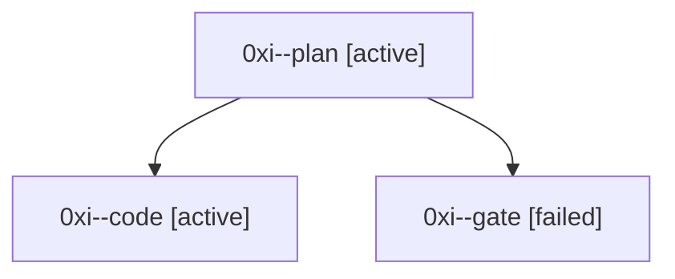

# Session: 0xi

[Agent Hoods](../README.md) / [bbugyi200](../users/bbugyi200/README.md) / [athena](../users/bbugyi200/machines/athena/README.md) / [0xi](../users/bbugyi200/machines/athena/hoods/0xi/README.md) / 0xi

Owner: `bbugyi200.athena` · Hood: `0xi` · Members: 3

## Lineage

The diagram is an optional enhancement; the ordered table below contains the same lineage in accessible text.

| Role | Agent | State | Model / provider | Timing | Commits | Prompt | Chat |
|---|---|---|---|---|---:|---|---|
| plan | 0xi--plan | active | opus / claude | 2026-10-06T20:09:52.722994+00:00 | 0 | [Prompt](../agents/bbugyi200.athena.0xi--plan/prompt.md) | [Chat](../agents/bbugyi200.athena.0xi--plan/chat.md) |
| code | 0xi--code | active | muse-spark-1.3-contributor / muse | 2026-10-06T20:18:18.725993+00:00 | [1](../agents/bbugyi200.athena.0xi--code/README.md#commits) | — | — |
| gate | 0xi--gate | failed | opus / claude | 2026-10-06T20:17:22.559507+00:00 → 2026-10-06T20:17:44.991667+00:00 | 0 | — | [Chat](../agents/bbugyi200.athena.0xi--gate/chat.md) |

## Commits

| Role | Repo | Commit | Subject | Committed |
|---|---|---|---|---|
| code | bob-cli | [`16aba77`](https://github.com/bobs-org/bob-cli/commit/16aba77ca975f9acc833300b7628291250bbe9bc) | docs(memory): add Inbox File glossary term | 2026-10-06 16:32:42 EDT |
