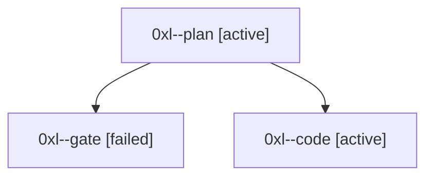

# Session: 0xl

[Agent Hoods](../README.md) / [bbugyi200](../users/bbugyi200/README.md) / [athena](../users/bbugyi200/machines/athena/README.md) / [0xl](../users/bbugyi200/machines/athena/hoods/0xl/README.md) / 0xl

Owner: `bbugyi200.athena` · Hood: `0xl` · Members: 3

## Lineage

The diagram is an optional enhancement; the ordered table below contains the same lineage in accessible text.

| Role | Agent | State | Model / provider | Timing | Commits | Prompt | Chat |
|---|---|---|---|---|---:|---|---|
| plan | 0xl--plan | active | opus / claude | 2026-10-06T22:22:20.357177+00:00 | 0 | [Prompt](../agents/bbugyi200.athena.0xl--plan/prompt.md) | [Chat](../agents/bbugyi200.athena.0xl--plan/chat.md) |
| gate | 0xl--gate | failed | opus / claude | 2026-10-06T22:30:07.703206+00:00 → 2026-10-06T22:30:28.620393+00:00 | 0 | — | [Chat](../agents/bbugyi200.athena.0xl--gate/chat.md) |
| code | 0xl--code | active | muse-spark-1.3-contributor / muse | 2026-10-06T22:30:49.802034+00:00 | 0 | — | — |
