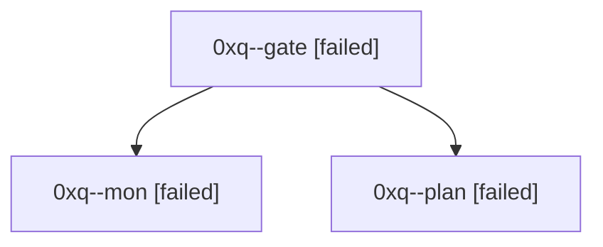

# Session: 0xq

[Agent Hoods](../README.md) / [bbugyi200](../users/bbugyi200/README.md) / [athena](../users/bbugyi200/machines/athena/README.md) / [0xq](../users/bbugyi200/machines/athena/hoods/0xq/README.md) / 0xq

Owner: `bbugyi200.athena` · Hood: `0xq` · Members: 3

## Lineage

The diagram is an optional enhancement; the ordered table below contains the same lineage in accessible text.

| Role | Agent | State | Model / provider | Timing | Commits | Prompt | Chat |
|---|---|---|---|---|---:|---|---|
| gate | 0xq--gate | failed | opus / claude | 2026-10-07T12:16:25.453273+00:00 → 2026-10-07T12:18:50.706226+00:00 | 0 | — | [Chat](../agents/bbugyi200.athena.0xq--gate/chat.md) |
| mon | 0xq--mon | failed | opus / claude | 2026-10-07T12:18:46.279321+00:00 → 2026-10-07T12:25:16.584859+00:00 | 0 | — | [Chat](../agents/bbugyi200.athena.0xq--mon/chat.md) |
| plan | 0xq--plan | failed | opus / claude | 2026-10-07T11:56:18.413074+00:00 → 2026-10-07T12:18:58.623520+00:00 | 0 | [Prompt](../agents/bbugyi200.athena.0xq--plan/prompt.md) | [Chat](../agents/bbugyi200.athena.0xq--plan/chat.md) |
