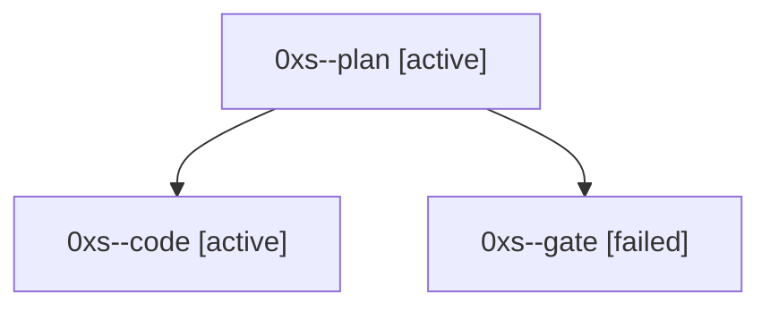

# Session: 0xs

[Agent Hoods](../README.md) / [bbugyi200](../users/bbugyi200/README.md) / [athena](../users/bbugyi200/machines/athena/README.md) / [0xs](../users/bbugyi200/machines/athena/hoods/0xs/README.md) / 0xs

Owner: `bbugyi200.athena` · Hood: `0xs` · Members: 3

## Lineage

The diagram is an optional enhancement; the ordered table below contains the same lineage in accessible text.

| Role | Agent | State | Model / provider | Timing | Commits | Prompt | Chat |
|---|---|---|---|---|---:|---|---|
| plan | 0xs--plan | active | opus / claude | 2026-10-07T14:02:46.981573+00:00 | 0 | [Prompt](../agents/bbugyi200.athena.0xs--plan/prompt.md) | [Chat](../agents/bbugyi200.athena.0xs--plan/chat.md) |
| code | 0xs--code | active | muse-spark-1.3-contributor / muse | 2026-10-07T14:10:42.251496+00:00 | [1](../agents/bbugyi200.athena.0xs--code/README.md#commits) | — | — |
| gate | 0xs--gate | failed | opus / claude | 2026-10-07T14:08:43.828366+00:00 → 2026-10-07T14:10:30.728675+00:00 | 0 | — | [Chat](../agents/bbugyi200.athena.0xs--gate/chat.md) |

## Commits

| Role | Repo | Commit | Subject | Committed |
|---|---|---|---|---|
| code | bob-cli | [`84a8a31`](https://github.com/bobs-org/bob-cli/commit/84a8a31e27de4b23a7aaeca77dd544d670810f26) | feat(ref): fold bob ref clip into bob ref create as hidden alias | 2026-10-07 10:43:17 EDT |
