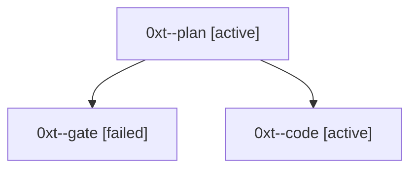

# Session: 0xt

[Agent Hoods](../README.md) / [bbugyi200](../users/bbugyi200/README.md) / [athena](../users/bbugyi200/machines/athena/README.md) / [0xt](../users/bbugyi200/machines/athena/hoods/0xt/README.md) / 0xt

Owner: `bbugyi200.athena` · Hood: `0xt` · Members: 3

## Lineage

The diagram is an optional enhancement; the ordered table below contains the same lineage in accessible text.

| Role | Agent | State | Model / provider | Timing | Commits | Prompt | Chat |
|---|---|---|---|---|---:|---|---|
| plan | 0xt--plan | active | opus / claude | 2026-10-07T14:41:27.196079+00:00 | 0 | [Prompt](../agents/bbugyi200.athena.0xt--plan/prompt.md) | [Chat](../agents/bbugyi200.athena.0xt--plan/chat.md) |
| gate | 0xt--gate | failed | opus / claude | 2026-10-07T14:51:51.238357+00:00 → 2026-10-07T14:52:47.519627+00:00 | 0 | — | [Chat](../agents/bbugyi200.athena.0xt--gate/chat.md) |
| code | 0xt--code | active | muse-spark-1.3-contributor / muse | 2026-10-07T14:53:33.576713+00:00 | 0 | — | — |
