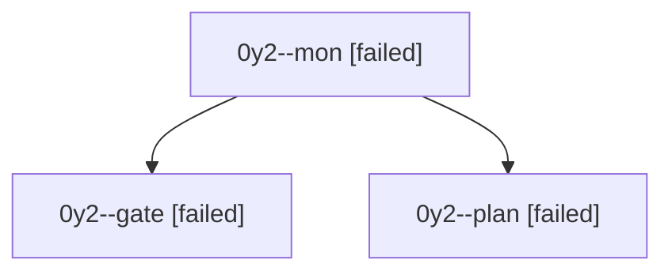

# Session: 0y2

[Agent Hoods](../README.md) / [bbugyi200](../users/bbugyi200/README.md) / [athena](../users/bbugyi200/machines/athena/README.md) / [0y2](../users/bbugyi200/machines/athena/hoods/0y2/README.md) / 0y2

Owner: `bbugyi200.athena` · Hood: `0y2` · Members: 3

## Lineage

The diagram is an optional enhancement; the ordered table below contains the same lineage in accessible text.

| Role | Agent | State | Model / provider | Timing | Commits | Prompt | Chat |
|---|---|---|---|---|---:|---|---|
| mon | 0y2--mon | failed | opus / claude | 2026-10-07T18:38:33.009494+00:00 → 2026-10-07T18:44:20.828981+00:00 | 0 | — | [Chat](../agents/bbugyi200.athena.0y2--mon/chat.md) |
| gate | 0y2--gate | failed | opus / claude | 2026-10-07T18:37:00.680537+00:00 → 2026-10-07T18:38:34.866311+00:00 | 0 | — | [Chat](../agents/bbugyi200.athena.0y2--gate/chat.md) |
| plan | 0y2--plan | failed | opus / claude | 2026-10-07T18:28:09.652366+00:00 → 2026-10-07T18:38:42.978459+00:00 | 0 | [Prompt](../agents/bbugyi200.athena.0y2--plan/prompt.md) | [Chat](../agents/bbugyi200.athena.0y2--plan/chat.md) |
