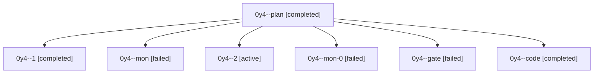

# Session: 0y4

[Agent Hoods](../README.md) / [bbugyi200](../users/bbugyi200/README.md) / [athena](../users/bbugyi200/machines/athena/README.md) / [0y4](../users/bbugyi200/machines/athena/hoods/0y4/README.md) / 0y4

Owner: `bbugyi200.athena` · Hood: `0y4` · Members: 7

## Lineage

The diagram is an optional enhancement; the ordered table below contains the same lineage in accessible text.

| Role | Agent | State | Model / provider | Timing | Commits | Prompt | Chat |
|---|---|---|---|---|---:|---|---|
| plan | 0y4--plan | completed | opus / claude | 2026-10-08T10:48:24.472534+00:00 → 2026-10-08T11:06:37.778598+00:00 | 0 | [Prompt](../agents/bbugyi200.athena.0y4--plan/prompt.md) | [Chat](../agents/bbugyi200.athena.0y4--plan/chat.md) |
| 1 | 0y4--1 | completed | muse-spark-1.3-contributor / muse | 2026-10-08T11:08:20.750042+00:00 → 2026-10-08T11:38:52.007258+00:00 | 0 | [Prompt](../agents/bbugyi200.athena.0y4--1/prompt.md) | [Chat](../agents/bbugyi200.athena.0y4--1/chat.md) |
| mon | 0y4--mon | failed | muse-spark-1.3-contributor / muse | 2026-10-08T11:06:05.677399+00:00 → 2026-10-08T11:07:55.721236+00:00 | 0 | — | [Chat](../agents/bbugyi200.athena.0y4--mon/chat.md) |
| 2 | 0y4--2 | active | muse-spark-1.3-contributor / muse | 2026-10-08T11:41:15.264682+00:00 | 0 | [Prompt](../agents/bbugyi200.athena.0y4--2/prompt.md) | — |
| mon-0 | 0y4--mon-0 | failed | muse-spark-1.3-contributor / muse | 2026-10-08T11:38:27.079136+00:00 → 2026-10-08T11:40:57.291454+00:00 | 0 | — | [Chat](../agents/bbugyi200.athena.0y4--mon-0/chat.md) |
| gate | 0y4--gate | failed | opus / claude | 2026-10-08T10:52:13.576335+00:00 → 2026-10-08T10:52:36.376186+00:00 | 0 | — | [Chat](../agents/bbugyi200.athena.0y4--gate/chat.md) |
| code | 0y4--code | completed | muse-spark-1.3-contributor / muse | 2026-10-08T10:52:52.050472+00:00 → 2026-10-08T11:06:37.778598+00:00 | 0 | — | [Chat](../agents/bbugyi200.athena.0y4--code/chat.md) |
