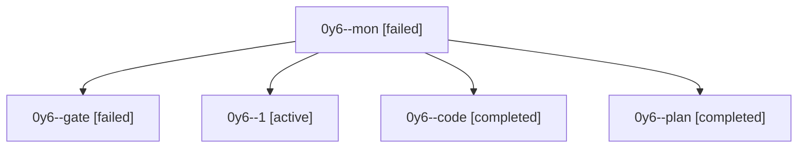

# Session: 0y6

[Agent Hoods](../README.md) / [bbugyi200](../users/bbugyi200/README.md) / [athena](../users/bbugyi200/machines/athena/README.md) / [0y6](../users/bbugyi200/machines/athena/hoods/0y6/README.md) / 0y6

Owner: `bbugyi200.athena` · Hood: `0y6` · Members: 5

## Lineage

The diagram is an optional enhancement; the ordered table below contains the same lineage in accessible text.

| Role | Agent | State | Model / provider | Timing | Commits | Prompt | Chat |
|---|---|---|---|---|---:|---|---|
| mon | 0y6--mon | failed | muse-spark-1.3-contributor / muse | 2026-10-08T13:35:00.194793+00:00 → 2026-10-08T13:37:02.815472+00:00 | 0 | — | [Chat](../agents/bbugyi200.athena.0y6--mon/chat.md) |
| gate | 0y6--gate | failed | opus / claude | 2026-10-08T13:00:26.059374+00:00 → 2026-10-08T13:00:49.229003+00:00 | 0 | — | [Chat](../agents/bbugyi200.athena.0y6--gate/chat.md) |
| 1 | 0y6--1 | active | muse-spark-1.3-contributor / muse | 2026-10-08T13:37:34.140567+00:00 | [1](../agents/bbugyi200.athena.0y6--1/README.md#commits) | [Prompt](../agents/bbugyi200.athena.0y6--1/prompt.md) | — |
| code | 0y6--code | completed | muse-spark-1.3-contributor / muse | 2026-10-08T13:01:05.494848+00:00 → 2026-10-08T13:35:47.990613+00:00 | 0 | — | [Chat](../agents/bbugyi200.athena.0y6--code/chat.md) |
| plan | 0y6--plan | completed | opus / claude | 2026-10-08T12:53:14.170048+00:00 → 2026-10-08T13:35:47.990613+00:00 | 0 | [Prompt](../agents/bbugyi200.athena.0y6--plan/prompt.md) | [Chat](../agents/bbugyi200.athena.0y6--plan/chat.md) |

## Commits

| Role | Repo | Commit | Subject | Committed |
|---|---|---|---|---|
| 1 | bob-cli | [`76f759e`](https://github.com/bobs-org/bob-cli/commit/76f759e16c68c67e8251a1eb8b060f92b1c0182f) | feat(highlights-ref): dedupe default create target with title identity and ingest auto-suffix | 2026-10-08 09:43:30 EDT |
