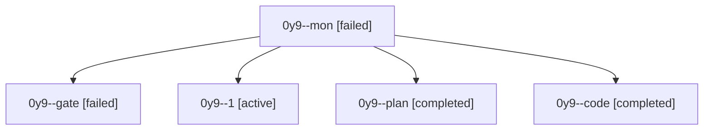

# Session: 0y9

[Agent Hoods](../README.md) / [bbugyi200](../users/bbugyi200/README.md) / [athena](../users/bbugyi200/machines/athena/README.md) / [0y9](../users/bbugyi200/machines/athena/hoods/0y9/README.md) / 0y9

Owner: `bbugyi200.athena` · Hood: `0y9` · Members: 5

## Lineage

The diagram is an optional enhancement; the ordered table below contains the same lineage in accessible text.

| Role | Agent | State | Model / provider | Timing | Commits | Prompt | Chat |
|---|---|---|---|---|---:|---|---|
| mon | 0y9--mon | failed | muse-spark-1.3-contributor / muse | 2026-10-08T14:17:15.155226+00:00 → 2026-10-08T14:21:00.685856+00:00 | 0 | — | [Chat](../agents/bbugyi200.athena.0y9--mon/chat.md) |
| gate | 0y9--gate | failed | opus / claude | 2026-10-08T13:51:48.556633+00:00 → 2026-10-08T13:52:39.131155+00:00 | 0 | — | [Chat](../agents/bbugyi200.athena.0y9--gate/chat.md) |
| 1 | 0y9--1 | active | muse-spark-1.3-contributor / muse | 2026-10-08T14:33:34.682349+00:00 | [1](../agents/bbugyi200.athena.0y9--1/README.md#commits) | [Prompt](../agents/bbugyi200.athena.0y9--1/prompt.md) | — |
| plan | 0y9--plan | completed | opus / claude | 2026-10-08T13:41:32.743634+00:00 → 2026-10-08T14:19:53.556914+00:00 | 0 | [Prompt](../agents/bbugyi200.athena.0y9--plan/prompt.md) | [Chat](../agents/bbugyi200.athena.0y9--plan/chat.md) |
| code | 0y9--code | completed | muse-spark-1.3-contributor / muse | 2026-10-08T13:52:51.184955+00:00 → 2026-10-08T14:19:53.556914+00:00 | 0 | — | [Chat](../agents/bbugyi200.athena.0y9--code/chat.md) |

## Commits

| Role | Repo | Commit | Subject | Committed |
|---|---|---|---|---|
| 1 | bob-cli | [`3d70446`](https://github.com/bobs-org/bob-cli/commit/3d704460e2bca6de3209cdaea1b79a5859be6e11) | feat(highlights-ref): support Blocked \[?\] ref task status with attached dependents | 2026-10-08 10:36:51 EDT |
