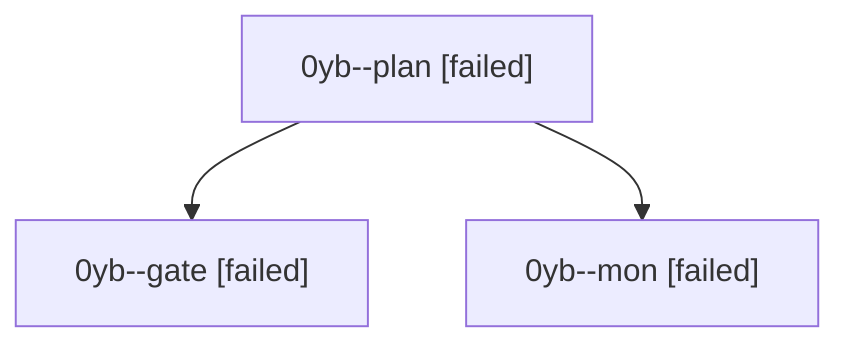

# Session: 0yb

[Agent Hoods](../README.md) / [bbugyi200](../users/bbugyi200/README.md) / [athena](../users/bbugyi200/machines/athena/README.md) / [0yb](../users/bbugyi200/machines/athena/hoods/0yb/README.md) / 0yb

Owner: `bbugyi200.athena` · Hood: `0yb` · Members: 3

## Lineage

The diagram is an optional enhancement; the ordered table below contains the same lineage in accessible text.

| Role | Agent | State | Model / provider | Timing | Commits | Prompt | Chat |
|---|---|---|---|---|---:|---|---|
| plan | 0yb--plan | failed | opus / claude | 2026-10-08T14:37:31.936975+00:00 → 2026-10-08T15:03:16.243893+00:00 | 0 | [Prompt](../agents/bbugyi200.athena.0yb--plan/prompt.md) | [Chat](../agents/bbugyi200.athena.0yb--plan/chat.md) |
| gate | 0yb--gate | failed | opus / claude | 2026-10-08T15:01:46.646571+00:00 → 2026-10-08T15:03:07.682314+00:00 | 0 | — | [Chat](../agents/bbugyi200.athena.0yb--gate/chat.md) |
| mon | 0yb--mon | failed | opus / claude | 2026-10-08T15:03:05.311861+00:00 → 2026-10-08T15:08:42.383117+00:00 | 0 | — | [Chat](../agents/bbugyi200.athena.0yb--mon/chat.md) |
