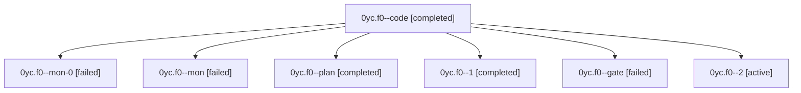

# Session: 0yc.f0

[Agent Hoods](../README.md) / [bbugyi200](../users/bbugyi200/README.md) / [athena](../users/bbugyi200/machines/athena/README.md) / [0yc](../users/bbugyi200/machines/athena/hoods/0yc/README.md) / 0yc.f0

Owner: `bbugyi200.athena` · Hood: `0yc` · Members: 7

## Lineage

The diagram is an optional enhancement; the ordered table below contains the same lineage in accessible text.

| Role | Agent | State | Model / provider | Timing | Commits | Prompt | Chat |
|---|---|---|---|---|---:|---|---|
| code | 0yc.f0--code | completed | muse-spark-1.3-contributor / muse | 2026-10-08T16:57:02.053632+00:00 → 2026-10-08T17:00:57.389470+00:00 | 0 | — | [Chat](../agents/bbugyi200.athena.0yc.f0--code/chat.md) |
| mon-0 | 0yc.f0--mon-0 | failed | muse-spark-1.3-contributor / muse | 2026-10-08T17:16:59.388767+00:00 → 2026-10-08T17:21:16.667492+00:00 | 0 | — | [Chat](../agents/bbugyi200.athena.0yc.f0--mon-0/chat.md) |
| mon | 0yc.f0--mon | failed | muse-spark-1.3-contributor / muse | 2026-10-08T17:00:21.948573+00:00 → 2026-10-08T17:04:39.163243+00:00 | 0 | — | [Chat](../agents/bbugyi200.athena.0yc.f0--mon/chat.md) |
| plan | 0yc.f0--plan | completed | grok-4.7 / grok | 2026-10-08T16:49:49.909421+00:00 → 2026-10-08T17:00:57.389470+00:00 | 0 | [Prompt](../agents/bbugyi200.athena.0yc.f0--plan/prompt.md) | [Chat](../agents/bbugyi200.athena.0yc.f0--plan/chat.md) |
| 1 | 0yc.f0--1 | completed | muse-spark-1.3-contributor / muse | 2026-10-08T17:05:08.886606+00:00 → 2026-10-08T17:17:50.506569+00:00 | 0 | [Prompt](../agents/bbugyi200.athena.0yc.f0--1/prompt.md) | [Chat](../agents/bbugyi200.athena.0yc.f0--1/chat.md) |
| gate | 0yc.f0--gate | failed | grok-4.7 / grok | 2026-10-08T16:56:24.226750+00:00 → 2026-10-08T16:56:45.672271+00:00 | 0 | — | [Chat](../agents/bbugyi200.athena.0yc.f0--gate/chat.md) |
| 2 | 0yc.f0--2 | active | muse-spark-1.3-contributor / muse | 2026-10-08T17:21:54.991519+00:00 | 0 | [Prompt](../agents/bbugyi200.athena.0yc.f0--2/prompt.md) | — |

## Neighbors

| Agent | Relation | State |
|---|---|---|
| [0yc](bbugyi200.athena.0yc.md) (session · 3) | ancestor | completed 2, failed 1 |
