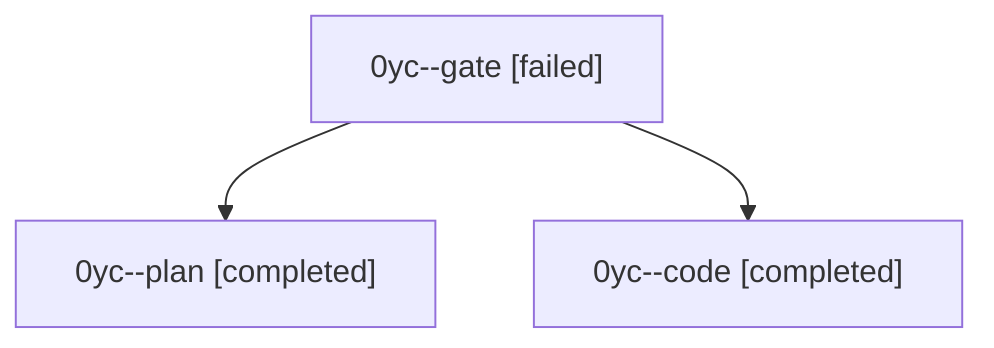

# Session: 0yc

[Agent Hoods](../README.md) / [bbugyi200](../users/bbugyi200/README.md) / [athena](../users/bbugyi200/machines/athena/README.md) / [0yc](../users/bbugyi200/machines/athena/hoods/0yc/README.md) / 0yc

Owner: `bbugyi200.athena` · Hood: `0yc` · Members: 3

## Lineage

The diagram is an optional enhancement; the ordered table below contains the same lineage in accessible text.

| Role | Agent | State | Model / provider | Timing | Commits | Prompt | Chat |
|---|---|---|---|---|---:|---|---|
| gate | 0yc--gate | failed | opus / claude | 2026-10-08T14:47:34.687131+00:00 → 2026-10-08T14:47:59.731108+00:00 | 0 | — | [Chat](../agents/bbugyi200.athena.0yc--gate/chat.md) |
| plan | 0yc--plan | completed | opus / claude | 2026-10-08T14:39:50.131630+00:00 → 2026-10-08T14:58:08.076908+00:00 | 0 | [Prompt](../agents/bbugyi200.athena.0yc--plan/prompt.md) | [Chat](../agents/bbugyi200.athena.0yc--plan/chat.md) |
| code | 0yc--code | completed | muse-spark-1.3-contributor / muse | 2026-10-08T14:48:15.573669+00:00 → 2026-10-08T14:58:08.076908+00:00 | 0 | — | [Chat](../agents/bbugyi200.athena.0yc--code/chat.md) |

## Neighbors

| Agent | Relation | State |
|---|---|---|
| [0yc.f0](bbugyi200.athena.0yc.f0.md) (session · 7) | descendant | active 1, completed 3, failed 3 |
