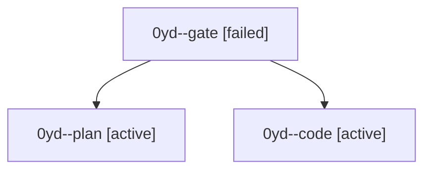

# Session: 0yd

[Agent Hoods](../README.md) / [bbugyi200](../users/bbugyi200/README.md) / [athena](../users/bbugyi200/machines/athena/README.md) / [0yd](../users/bbugyi200/machines/athena/hoods/0yd/README.md) / 0yd

Owner: `bbugyi200.athena` · Hood: `0yd` · Members: 3

## Lineage

The diagram is an optional enhancement; the ordered table below contains the same lineage in accessible text.

| Role | Agent | State | Model / provider | Timing | Commits | Prompt | Chat |
|---|---|---|---|---|---:|---|---|
| gate | 0yd--gate | failed | opus / claude | 2026-10-08T16:16:53.143833+00:00 → 2026-10-08T16:17:16.628772+00:00 | 0 | — | [Chat](../agents/bbugyi200.athena.0yd--gate/chat.md) |
| plan | 0yd--plan | active | opus / claude | 2026-10-08T16:07:38.276922+00:00 | 0 | [Prompt](../agents/bbugyi200.athena.0yd--plan/prompt.md) | [Chat](../agents/bbugyi200.athena.0yd--plan/chat.md) |
| code | 0yd--code | active | muse-spark-1.3-contributor / muse | 2026-10-08T16:17:38.055888+00:00 | 0 | — | — |
