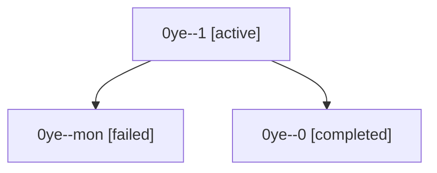

# Session: 0ye

[Agent Hoods](../README.md) / [bbugyi200](../users/bbugyi200/README.md) / [athena](../users/bbugyi200/machines/athena/README.md) / [0ye](../users/bbugyi200/machines/athena/hoods/0ye/README.md) / 0ye

Owner: `bbugyi200.athena` · Hood: `0ye` · Members: 3

## Lineage

The diagram is an optional enhancement; the ordered table below contains the same lineage in accessible text.

| Role | Agent | State | Model / provider | Timing | Commits | Prompt | Chat |
|---|---|---|---|---|---:|---|---|
| 1 | 0ye--1 | active | muse-spark-1.3-contributor / muse | 2026-10-08T17:00:47.502260+00:00 | [1](../agents/bbugyi200.athena.0ye--1/README.md#commits) | [Prompt](../agents/bbugyi200.athena.0ye--1/prompt.md) | — |
| mon | 0ye--mon | failed | muse-spark-1.3-contributor / muse | 2026-10-08T16:58:12.710648+00:00 → 2026-10-08T17:00:15.919654+00:00 | 0 | — | [Chat](../agents/bbugyi200.athena.0ye--mon/chat.md) |
| 0 | 0ye--0 | completed | muse-spark-1.3-contributor / muse | 2026-10-08T16:42:53.784353+00:00 → 2026-10-08T16:58:47.968495+00:00 | 0 | [Prompt](../agents/bbugyi200.athena.0ye--0/prompt.md) | [Chat](../agents/bbugyi200.athena.0ye--0/chat.md) |

## Commits

| Role | Repo | Commit | Subject | Committed |
|---|---|---|---|---|
| 1 | bob-cli | [`b0f2960`](https://github.com/bobs-org/bob-cli/commit/b0f2960d4210b2abd9627895aa8c585fcf1c81ea) | test(freshness): add hidden recurring reference parity coverage | 2026-10-08 13:04:08 EDT |
