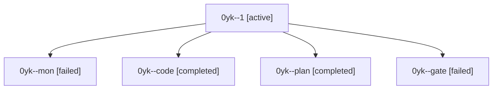

# Session: 0yk

[Agent Hoods](../README.md) / [bbugyi200](../users/bbugyi200/README.md) / [athena](../users/bbugyi200/machines/athena/README.md) / [0yk](../users/bbugyi200/machines/athena/hoods/0yk/README.md) / 0yk

Owner: `bbugyi200.athena` · Hood: `0yk` · Members: 5

## Lineage

The diagram is an optional enhancement; the ordered table below contains the same lineage in accessible text.

| Role | Agent | State | Model / provider | Timing | Commits | Prompt | Chat |
|---|---|---|---|---|---:|---|---|
| 1 | 0yk--1 | active | muse-spark-1.3-contributor / muse | 2026-10-09T12:27:50.866722+00:00 | 0 | [Prompt](../agents/bbugyi200.athena.0yk--1/prompt.md) | — |
| mon | 0yk--mon | failed | muse-spark-1.3-contributor / muse | 2026-10-09T12:23:08.486248+00:00 → 2026-10-09T12:27:22.932213+00:00 | 0 | — | [Chat](../agents/bbugyi200.athena.0yk--mon/chat.md) |
| code | 0yk--code | completed | muse-spark-1.3-contributor / muse | 2026-10-09T12:06:48.341728+00:00 → 2026-10-09T12:23:48.560618+00:00 | 0 | [Prompt](../agents/bbugyi200.athena.0yk--code/prompt.md) | [Chat](../agents/bbugyi200.athena.0yk--code/chat.md) |
| plan | 0yk--plan | completed | opus / claude | 2026-10-09T06:06:24.643879+00:00 → 2026-10-09T06:21:20.052430+00:00 | 0 | [Prompt](../agents/bbugyi200.athena.0yk--plan/prompt.md) | [Chat](../agents/bbugyi200.athena.0yk--plan/chat.md) |
| gate | 0yk--gate | failed | opus / claude | 2026-10-09T12:05:29.069683+00:00 → 2026-10-09T12:06:06.548731+00:00 | 0 | — | [Chat](../agents/bbugyi200.athena.0yk--gate/chat.md) |
