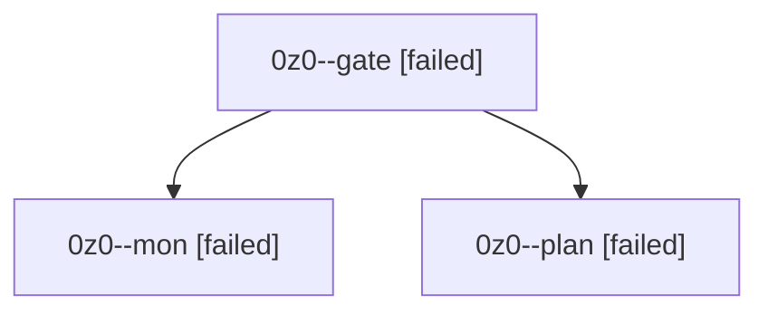

# Session: 0z0

[Agent Hoods](../README.md) / [bbugyi200](../users/bbugyi200/README.md) / [athena](../users/bbugyi200/machines/athena/README.md) / [0z0](../users/bbugyi200/machines/athena/hoods/0z0/README.md) / 0z0

Owner: `bbugyi200.athena` · Hood: `0z0` · Members: 3

## Lineage

The diagram is an optional enhancement; the ordered table below contains the same lineage in accessible text.

| Role | Agent | State | Model / provider | Timing | Commits | Prompt | Chat |
|---|---|---|---|---|---:|---|---|
| gate | 0z0--gate | failed | opus / claude | 2026-10-09T16:27:46.928259+00:00 → 2026-10-09T16:29:30.245003+00:00 | 0 | — | [Chat](../agents/bbugyi200.athena.0z0--gate/chat.md) |
| mon | 0z0--mon | failed | opus / claude | 2026-10-09T16:29:29.455252+00:00 → 2026-10-09T16:34:44.116958+00:00 | 0 | — | [Chat](../agents/bbugyi200.athena.0z0--mon/chat.md) |
| plan | 0z0--plan | failed | opus / claude | 2026-10-09T15:59:37.769401+00:00 → 2026-10-09T16:29:34.007842+00:00 | 0 | [Prompt](../agents/bbugyi200.athena.0z0--plan/prompt.md) | [Chat](../agents/bbugyi200.athena.0z0--plan/chat.md) |

## Neighbors

| Agent | Relation | State |
|---|---|---|
| [0z0.w0](../agents/bbugyi200.athena.0z0.w0/README.md) | descendant | active |
